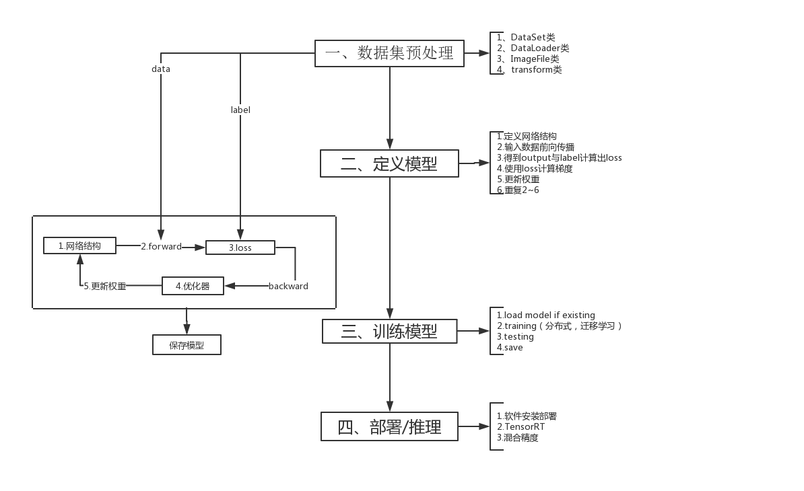

# pytorch1.3.0学习笔记  

## 一、资源
[官网](https://pytorch.org/) | [GitHub](https://github.com/pytorch/pytorch) | [Examples](https://github.com/pytorch/examples)  | [Tutorials](https://github.com/pytorch/tutorials) | [API](https://pytorch-cn.readthedocs.io/zh/latest/#pytorch)  | [apachecn](https://github.com/apachecn/pytorch-doc-zh)  | [tnt](https://github.com/pytorch/tnt)  | [d2l](https://github.com/ShusenTang/Dive-into-DL-PyTorch)|[什么是pytorch？](notes/pytorch.md)|[备忘录](https://pytorch.org/tutorials/beginner/ptcheat.html) 

[学习步骤](notes/api/pytorch-api.md)：数据读取-->网络构建-->损失函数-->BP算法-->优化函数-->GPU加速（节省GPU、C++加速、多GPU训练等）   
## 二、源码学习
[torch包的目录结构](notes/api/torch_arch.md)
* [torch](notes/api/torch.md)   
* [torch.nn](notes/api/torch_nn.md)
* [torch.nn.functional](notes/api/torch_nn_funtional.md)
* [torch.Tensor](notes/api/torch_tensor.md)
* [torch.Attributes](notes/api/torch_attributes.md)
* [torch.autograd](notes/api/torch_tensor.md)
* [torch.cuda](notes/api/torch_cuda.md)
* [torch.distributed](notes/api/torch_distributed.md)
* [torch.distributions](notes/api/torch_distributions.md)
* [torch.hub](notes/api/torch_hub.md)
* torch.jit
* [torch.nn.init](notes/api/torch_nn_init.md)
* [torch.onnx](notes/api/torch_onnx.md)
* [torch.optim](notes/api/torch_opt.md)
* Quantization
* torch.random
* torch.sparse
* torch.Storage
* torch.utils.bottleneck
* torch.utils.checkpoint
* torch.utils.cpp_extension
* [torch.utils.data](notes/api/torch_utils_data.md)
* torch.utils.dlpack
* torch.utils.model_zoo
* [torch.utils.tensorboard](notes/api/torch_utils_tensorboard.md)
* Type Info
* Named Tensors
* Named Tensors operator coverageß
* torch.__config__
## 三、基础&学习笔记
### 0、数据读取

### 1、网络模型
* [神经网络](notes/nn/nn.md)
* [自动微分](notes/nn/autograd.md)
* [训练分类器](notes/nn/training_classifier.md)
* [模型加载/参数初始化/Finetune](notes/nn/lif.md)
* [torch.nn](code/nn_tutorial.ipynb)
* [torch.nn与torch.nn.Functional区别](notes/nn/qubie.md)
### 2、损失函数

### 3、BP

### 4、优化器
* [torch.optim](notes/optim/opt.md)
### 5、模型保存&迁移学习&...
* 模型保存
    * [模型保存与加载](notes/others/load_save_model.md)
* 迁移学习
    * [迁移学习](code/transferlearning.ipynb)
* Tensorboard
    *[实例-1](notes/others/tensorboard01.md)
### 6、分布式
[分布式训练原理](notes/dist/distributed.md)    
[torch.distributed](notes/dist/torch-distributed.md)
* 模型并行
    * [官方demo](https://pytorch.org/tutorials/intermediate/model_parallel_tutorial.html)
* 数据并行
    * [Pytorch单机多卡和多机多卡分布式](notes/dist/multigpus.md)
    * [Data Parallelism](notes/dist/dataparallelism.md) 
* 模型并行&数据并行
    * [官方Demo](https://pytorch.org/tutorials/intermediate/ddp_tutorial.html)
### 7、加速运行
* [自定义 C++ 与 CUDA 拓展](notes/acc/cuda.md)
* [Pytorch有什么节省内存（显存）的小技巧？](notes/acc/save.md)
* [GPU 显存不足怎么办？](notes/acc/save_2.md)
# 参考
[1] [BenchMark](https://github.com/fusimeng/framework_benchmark)    
[2]  https://blog.csdn.net/rogerfang/article/details/82291464   
