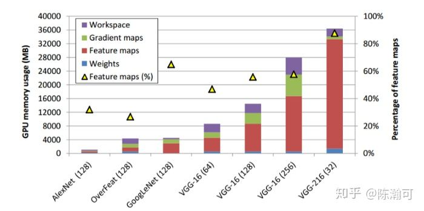

# Pytorch有什么节省内存（显存）的小技巧？
一般呢，神经网络显存的占用可以简单分为这三部分：    
* 网络模型自身参数占用的显存。
* 模型计算时（包括forward/backward/optimizer）所产生的中间变量或参数也有占用显存。
* 编程框架自身一些额外的开销。

### 基本操作 check list:
* relu 用 inplace=True
* 用 eval() 和 with torch.no_grad():
* 每个 batch 后认真的把所有参数从 GPU 拿出来后删除
* 虽然很多回答建议用, 但我建议不要用 torch.cuda.empty_cache()，这只是释放 GPU 缓存而使得nvidia-smi能看得见 pytorch 自动释放的内存而已. 99% 的用户不需要使用这个命令. 并有用户反应每次用反而会减慢 1~2s.
* 注意: 当每张 GPU 里面的 batch_size 太小(<8)时用 batch_norm 会导致训练不稳定, 除非你用以下所说的 APEX 来实现多 GPU sync_bn
* torch.backends.cudnn.deterministic = True用不用对 GPU 内存占用和效率都没有什么太大的影响. 建议开着.
* 不要用 .cpu() 来取 GPU 里面出来的图片. 这样做的话训练时长可能翻倍.

## 一、0x00 浮点混合运算 (节省 20% 左右) 
* 使用环境: 所有. 对    
* 实现: 使用 [APEX](https://github.com/NVIDIA/apex) 

安装只需要三行命令: 但有坑, 请按照此教程一步一步来    
[排错教程](https://zhuanlan.zhihu.com/p/80386137)    
回答太长了, 我写入知乎文章. 有需要可点进去查看 (如有问题欢迎骚扰)   
## 二、0x01 以下介绍 0 成本节省显存方法: 优化架构代码
* TL;DR:    
用 `del` 或 `replacing variables` 的方法像减少 cpu 内存占用一样减少 gpu 显存占用
* 使用环境:   
自定义或复杂的网络架构; 特别是 unet 等需要再利用 `feature_map` 的网络架构   
    
* 问题:    
如图,大部分的显存都被 `feature_map` 占用用来 `back prop`,说明 input 的大小和模型的大小基本上就能决定显存的占用.但是 `forward` 计算过程中能不能偷工减料?   
* 原理:   
众所周知 pytorch 架构中的 forward 是实际上 tensor 在 gpu 的走法，那么 forward 中的代码就会影响 gpu 的使用.   
* 实现:    
研究 pytorch 官方架构就会发现大部分 forward pass 都是`x = self.conv(x)` 的形式, 很少 introduce new variable. 所以: (1) 把不需要的变量都由 `x` 代替; (2) 变量用完后用 `del` 删除.   
例子  
```python
def forward(self, x):
    conv2 = self.conv2(self.conv1(x)) #1/4
    del x
    conv3 = self.conv3(conv2) #1/8
    conv4 = self.conv4(conv3) #1/16
    conv5 = self.conv5(conv4) #1/32

    center_64 = self.center_conv1x1(self.center_global_pool(conv5))

    d5 = self.decoder5(self.center(conv5), conv5)
    del conv5
    d4 = self.decoder4(d5, conv4)
    del conv4
    d3 = self.decoder3(d4, conv3)
    del conv3
    d2 = self.decoder2(d3, conv2)
    del conv2

    hypercol = F.dropout2d(torch.cat((
        self.decoder1(d2),
        F.upsample(d2, scale_factor=2,mode='bilinear'),
        F.upsample(d3, scale_factor=4, mode='bilinear'),
        F.upsample(d4, scale_factor=8, mode='bilinear'),
        F.upsample(d5, scale_factor=16, mode='bilinear')),1), p=0.50)
    hypercol_add_center = self.logits_final(torch.cat((
        hypercol,
        F.upsample(center_64, scale_factor=hypercol.shape[2],mode='bilinear')),1))
    return self.center_fc(center_64.view(center_64.size(0), -1)),self.logits_no_empty(hypercol),hypercol_add_center   
```
*(此方法经过单变量测试确实有效-成功放入1024x1024的图片-,但理论尚未严格证明,如有说错请指出.本文只解决显存问题,对显卡利用效率没有研究.可能会影响 backprop 速度.)*    
### Reference   
[1] https://zhuanlan.zhihu.com/p/39752167     
[2] https://medium.com/syncedreview/how-to-train-a-very-large-and-deep-model-on-one-gpu-7b7edfe2d072   
[3] https://pytorch.org/docs/stable/notes/cuda.html    
[4] https://stackoverflow.com/questions/55667005/manage-memory-differently-on-train-and-test-time-pytorch    
## 三、0x02 以下介绍 0 成本节省显存方法: 读取数据并行操作
按照以下方式设置 pytorch 的 train_loader:   
* num_workers: CPU 使用线程. 一般建议这个值填写你机器总共 CPU 的数量   
* pin_memory: 是否先把数据加载到缓存再加载到GPU. 如果你用的不是你私人工作电脑, 请开启.
* pin_memory: 是否先把数据加载到缓存再加载到GPU. 如果你用的不是你私人工作电脑, 请开启.   

```python
data_loader = data.DataLoader(YOUR_PYTORCH_DATASET,
                num_workers=THE_NUMBER_OF_CPU_I_HAVE,
                pin_memory=True,
                drop_last=True,# Last batch will mess up with batch norm https://github.com/pytorch/pytorch/issues/4534
                ))
```
如果你按照上面的方法把pin_memory开启了的话, 请数据放入 GPU 的时候把non_blocking开启. 这样如果你只把数据放入 GPU 而不把数据从 GPU 拿出来再做计算的话就会加快很多(据用户报告可加速 50%). 就算你把 GPU 中数据拿出来(ie. 用了.cpu()命令, 最坏的结果也是与non_blocking=False相当:    
```python
"""Sync Point"""
image = image.cuda(non_blocking=True)
labels = labels.cuda(non_blocking=True).float()

"""Async Point"""
prediction = net(image)
```
## 教程-2：针对显存OOM
* 0.利用nvidia-smi -lms检查是是否有显存泄露情况，即显存消耗越来越高
* 1.尽量使用inplace操作/flag，如nn.ReLU(inplace=True)
* 2.减少batch size/input size
* 3.使用0.4.0的新feature: checkpoint

### 1、
尽可能使用inplace操作， 比如relu 可以使用 inplace=True 。一个简单的使用方法，如下：
```python
def inplace_relu(m):
    classname = m.__class__.__name__
    if classname.find('ReLU') != -1:
        m.inplace=True

model.apply(inplace_relu)
```
### 2、
进一步，比如ResNet 和 DenseNet 可以将 batchnorm 和relu打包成inplace，在bp时再重新计算。使用到了pytorch新的checkpoint特性，有以下两个代码。由于需要重新计算bn后的结果，所以会慢一些。    
https://github.com/gpleiss/efficient_densenet_pytorch   
https://github.com/mapillary/inplace_abn   
### 3、每次循环结束时 删除 loss，可以节约很少显存，但聊胜于无。可见如下issue
https://discuss.pytorch.org/t/tensor-to-variable-and-memory-freeing-best-practices/6000/2
### 4. 使用float16精度混合计算。   
我用过 
NVIDIA英伟达
 apex，很好用，可以节约将近50%的显存，但是要小心一些不安全的操作如 mean和sum，溢出fp16。    
补充：最近我也尝试在我CVPR19的GAN模型中加入fp16的训练，可以从15G的显存需求降到约10G，这样大多数1080Ti等较为常见的显卡就可以训练了。欢迎大家star一波   
https://github.com/NVlabs/DG-Net   
### 5、对于不需要bp的forward，如validation 请使用 torch.no_grad , 注意model.eval() 不等于 torch.no_grad() 请看如下讨论。   
https://discuss.pytorch.org/t/model-eval-vs-with-torch-no-grad/19615    
### 6. torch.cuda.empty_cache() 这是del的进阶版，使用nvidia-smi 会发现显存有明显的变化。但是训练时最大的显存占用似乎没变。大家可以试试。   
https://discuss.pytorch.org/t/how-can-we-release-gpu-memory-cache/14530   
另外，会影响精度的骚操作还有:

把一个batchsize=64分为两个32的batch，两次forward以后，backward一次。但会影响 batchnorm等和batchsize相关的层。

### 7、
https://github.com/Lyken17/pytorch-memonger


## Reference
[1] https://www.zhihu.com/question/274635237      
[2] https://discuss.pytorch.org/t/about-torch-cuda-empty-cache/34232/5   
[3] https://www.pytorchtutorial.com/pytorch-large-batches-multi-gpu-and-distributed-training/   
[4] https://sagivtech.com/2017/09/19/optimizing-pytorch-training-code/   


