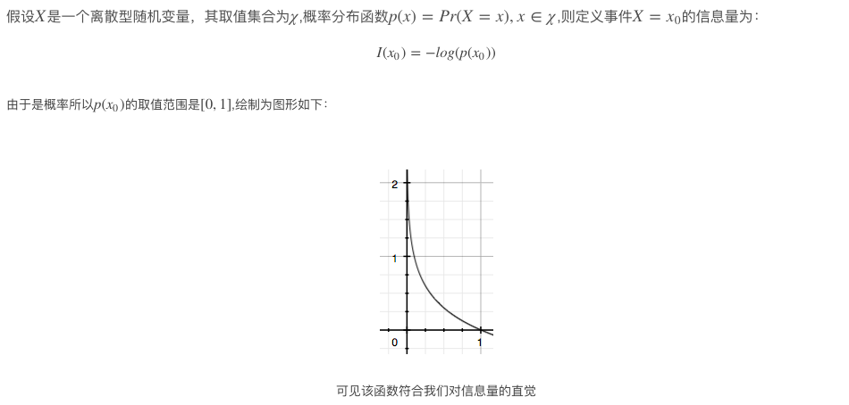
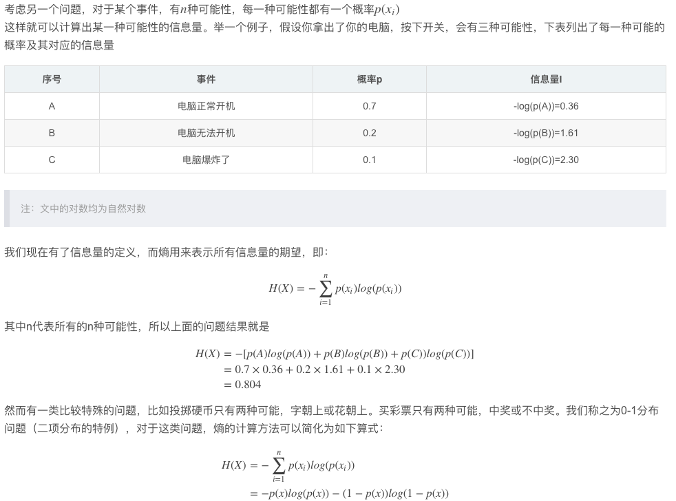
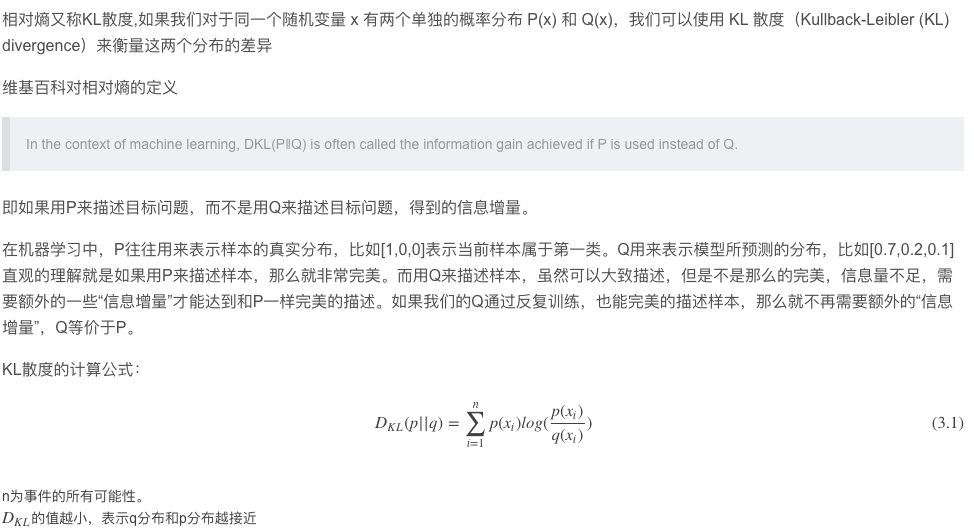
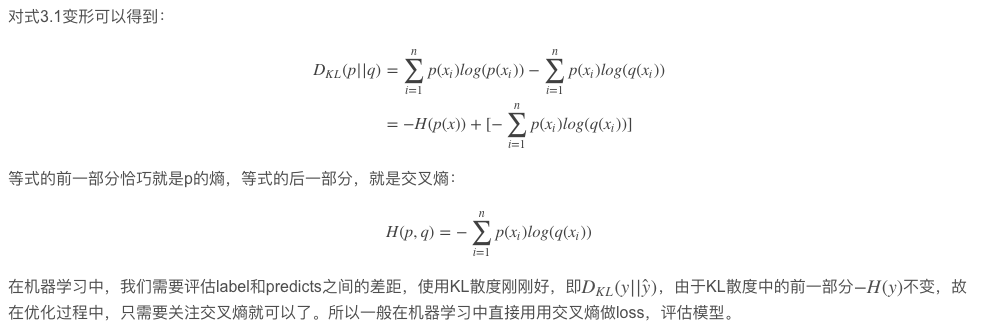
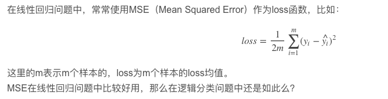
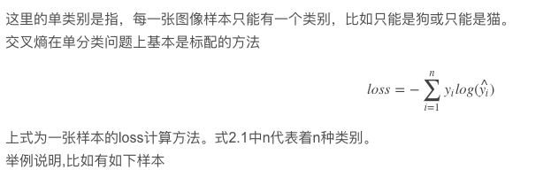
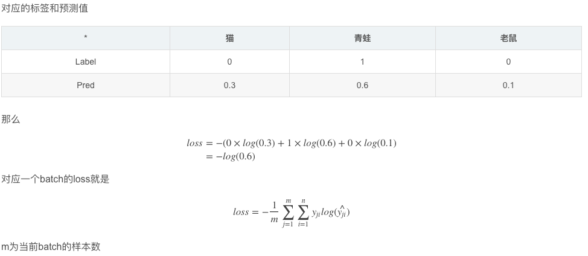
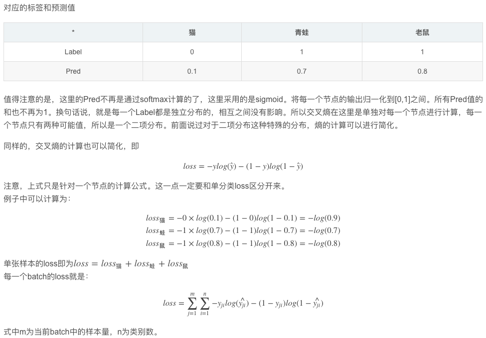

# 关于交叉熵在loss函数中使用的理解
交叉熵（cross entropy）是深度学习中常用的一个概念，一般用来求目标与预测值之间的差距。以前做一些分类问题的时候，没有过多的注意，直接调用现成的库，用起来也比较方便。最近开始研究起对抗生成网络（GANs），用到了交叉熵，发现自己对交叉熵的理解有些模糊，不够深入。遂花了几天的时间从头梳理了一下相关知识点，才算透彻的理解了，特地记录下来，以便日后查阅。

## 一、信息论
交叉熵是信息论中的一个概念，要想了解交叉熵的本质，需要先从最基本的概念讲起。
### 1、信息量
首先是信息量。假设我们听到了两件事，分别如下：   
事件A：巴西队进入了2018世界杯决赛圈。   
事件B：中国队进入了2018世界杯决赛圈。   

仅凭直觉来说，显而易见事件B的信息量比事件A的信息量要大。究其原因，是因为事件A发生的概率很大，事件B发生的概率很小。所以当越不可能的事件发生了，我们获取到的信息量就越大。越可能发生的事件发生了，我们获取到的信息量就越小。那么信息量应该和事件发生的概率有关。   
   
### 2、熵
   
### 3、相对熵（KL散度）
   
### 4、交叉熵
   

## 二、机器学习中交叉熵的应用
### 1、为什么要用交叉熵做loss函数？
   

### 2、交叉熵在单分类问题中的使用
   
   
   
 
### 3、交叉熵在多分类问题中的使用
这里的多类别是指，每一张图像样本可以有多个类别，比如同时包含一只猫和一只狗
和单分类问题的标签不同，多分类的标签是n-hot。
比如下面这张样本图，即有青蛙，又有老鼠，所以是一个多分类问题
  
  
## Reference
[1] https://blog.csdn.net/tsyccnh/article/details/79163834   
