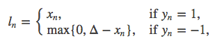

# Loss functions
[source](https://pytorch.org/docs/stable/nn.html#loss-functions)   
* loss functions
    * L1Loss
    * MSELoss
    * CrossEntropyLoss
    * CTCLoss
    * NLLLoss
    * PoissonNLLLoss
    * KLDivLoss
    * BCELoss
    * BCEWithLogitsLoss
    * MarginRankingLoss
    * HingeEmbeddingLoss
    * MultiLabelMarginLoss
    * SmoothL1Loss
    * SoftMarginLoss
    * MultiLabelSoftMarginLoss
    * CosineEmbeddingLoss
    * MultiMarginLoss
    * TripletMarginLoss

损失函数通过torch.nn包实现  
### 基本用法
* criterion = LossCriterion() #构造函数有自己的参数
* loss = criterion(x, y) #调用标准时也有参数
## 一、L1Loss
`class torch.nn.L1Loss(size_average=None, reduce=None, reduction='mean')`     
* 功能：  
计算output和target之差的绝对值，可选返回同维度的tensor或者是一个标量。
* 计算公式：   
   
* 参数：   
reduction-三个值，none: 不使用约简；mean:返回loss和的平均值；sum:返回loss的和。默认：mean。
* 实例：
```python
import torch
import torch.nn as nn

# ----------------------------------- L1 Loss

# 生成网络输出 以及 目标输出
output = torch.ones(2, 2, requires_grad=True)*0.5
target = torch.ones(2, 2)

# 设置三种不同参数的L1Loss
l1_1 = nn.L1Loss(reduction='none')
l1_sum = nn.L1Loss(reduction='sum')
l1_mean = nn.L1Loss(reduction='mean')

o_0 = l1_1(output, target)
o_1 = l1_sum(output, target)
o_2 = l1_mean(output, target)

print('\nreduce=none, 输出同维度的loss:\n{}\n'.format(o_0))
print('reduce=sum，\t求和:\t{}'.format(o_1))
print('reduce=mean，\t求平均:\t{}'.format(o_2))
```
```
output:
root@ff:~# python l1.py 

reduce=none, 输出同维度的loss:
tensor([[0.5000, 0.5000],
        [0.5000, 0.5000]], grad_fn=<L1LossBackward>)

reduce=sum，	求和:	2.0
reduce=mean，	求平均:	0.5
```
## 二、MSELoss
`class torch.nn.MSELoss(size_average=None, reduce=None, reduction='mean')`     
* 功能：   
计算output和target之差的平方，可选返回同维度的tensor或者是一个标量。
* 计算公式：  
   
* 参数：   
reduction-三个值，none: 不使用约简；mean:返回loss和的平均值；sum:返回loss的和。默认：mean。
* 实例：    
```python
# coding: utf-8

import torch
import torch.nn as nn

# ----------------------------------- MSE loss

# 生成网络输出 以及 目标输出
output = torch.ones(2, 2, requires_grad=True) * 0.5
target = torch.ones(2, 2)

# 设置三种不同参数的L1Loss
reduce_False = nn.MSELoss(reduction='none')
size_average_True = nn.MSELoss(reduction='sum')
size_average_False = nn.MSELoss(reduction='mean')


o_0 = reduce_False(output, target)
o_1 = size_average_True(output, target)
o_2 = size_average_False(output, target)

print('\nnone, 输出同维度的loss:\n{}\n'.format(o_0))
print('sum，\t求和:\t{}'.format(o_1))
print('mean，\t求平均:\t{}'.format(o_2))
```
```
output:
root@ff:~# python mse.py 

none, 输出同维度的loss:
tensor([[0.2500, 0.2500],
        [0.2500, 0.2500]], grad_fn=<MseLossBackward>)

sum，	求和:	1.0
mean，	求平均:	0.25
```
## 三、CrossEntropyLoss
[极大似然估计](mle.md)   
[交叉熵损失函数](crossentropy.md)   

`class torch.nn.CrossEntropyLoss(weight=None, size_average=None, ignore_index=-100, reduce=None, reduction='mean')`    
* 功能：  
将输入经过softmax激活函数之后，再计算其与target的交叉熵损失。即该方法将nn.LogSoftmax()和 nn.NLLLoss()进行了结合。严格意义上的交叉熵损失函数应该是nn.NLLLoss()。

* 补充：小谈交叉熵损失函数   
交叉熵损失(cross-entropy Loss) 又称为对数似然损失(Log-likelihood Loss)、对数损失；二分类时还可称之为逻辑斯谛回归损失(Logistic Loss)。交叉熵损失函数表达式为 L = - sigama(y_i * log(x_i))。pytroch这里不是严格意义上的交叉熵损失函数，而是先将input经过softmax激活函数，将向量“归一化”成概率形式，然后再与target计算严格意义上交叉熵损失。   
在多分类任务中，经常采用softmax激活函数+交叉熵损失函数，因为交叉熵描述了两个概率分布的差异，然而神经网络输出的是向量，并不是概率分布的形式。所以需要softmax激活函数将一个向量进行“归一化”成概率分布的形式，再采用交叉熵损失函数计算loss。
再回顾PyTorch的CrossEntropyLoss()，官方文档中提到时将nn.LogSoftmax()和 nn.NLLLoss()进行了结合，nn.LogSoftmax() 相当于激活函数 ， nn.NLLLoss()是损失函数，将其结合，完整的是否可以叫做softmax+交叉熵损失函数呢？   
* 计算公式：   
   

* 参数：  
    * weight (Tensor, optional) – 自定义的每个类别的权重. 必须是一个长度为 C 的 Tensor
    * ignore_index (int, optional) – 设置一个目标值, 该目标值会被忽略, 从而不会影响到 输入的梯度。
    * reduction-三个值，none: 不使用约简；mean:返回loss和的平均值；sum:返回loss的和。默认：mean。
* 实例：   
```python
# coding: utf-8

import torch
import torch.nn as nn
import numpy as np
import math

# ----------------------------------- CrossEntropy loss: base

loss_f = nn.CrossEntropyLoss(weight=None, reduction='none')
# 生成网络输出 以及 目标输出
output = torch.ones(2, 3, requires_grad=True) * 0.5      # 假设一个三分类任务，batchsize=2，假设每个神经元输出都为0.5
target = torch.from_numpy(np.array([0, 1])).type(torch.LongTensor)

loss = loss_f(output, target)

print('--------------------------------------------------- CrossEntropy loss: base')
print('loss: ', loss)
print('由于reduction=none，所以可以看到每一个样本的loss，输出为[1.0986, 1.0986]')


# 熟悉计算公式，手动计算第一个样本
output = output[0].detach().numpy()
output_1 = output[0]              # 第一个样本的输出值
target_1 = target[0].numpy()

# 第一项
x_class = output[target_1]
# 第二项
exp = math.e
sigma_exp_x = pow(exp, output[0]) + pow(exp, output[1]) + pow(exp, output[2])
log_sigma_exp_x = math.log(sigma_exp_x)
# 两项相加
loss_1 = -x_class + log_sigma_exp_x
print('---------------------------------------------------  手动计算')
print('第一个样本的loss：', loss_1)


# ----------------------------------- CrossEntropy loss: weight

weight = torch.from_numpy(np.array([0.6, 0.2, 0.2])).float()
loss_f = nn.CrossEntropyLoss(weight=weight, reduction='none')
output = torch.ones(2, 3, requires_grad=True) * 0.5  # 假设一个三分类任务，batchsize为2个，假设每个神经元输出都为0.5
target = torch.from_numpy(np.array([0, 1])).type(torch.LongTensor)
loss = loss_f(output, target)
print('\n\n--------------------------------------------------- CrossEntropy loss: weight')
print('loss: ', loss)  #
print('原始loss值为1.0986, 第一个样本是第0类，weight=0.6,所以输出为1.0986*0.6 =', 1.0986*0.6)

# ----------------------------------- CrossEntropy loss: ignore_index

loss_f_1 = nn.CrossEntropyLoss(weight=None, reduction='none', ignore_index=1)
loss_f_2 = nn.CrossEntropyLoss(weight=None, reduction='none', ignore_index=2)

output = torch.ones(3, 3, requires_grad=True) * 0.5  # 假设一个三分类任务，batchsize为2个，假设每个神经元输出都为0.5
target = torch.from_numpy(np.array([0, 1, 2])).type(torch.LongTensor)

loss_1 = loss_f_1(output, target)
loss_2 = loss_f_2(output, target)

print('\n\n--------------------------------------------------- CrossEntropy loss: ignore_index')
print('ignore_index = 1: ', loss_1)     # 类别为1的样本的loss为0
print('ignore_index = 2: ', loss_2)     # 类别为2的样本的loss为0
```
```
output:
root@ff:~# python crossentropyloss.py 
--------------------------------------------------- CrossEntropy loss: base
loss:  tensor([1.0986, 1.0986], grad_fn=<NllLossBackward>)
由于reduction=none，所以可以看到每一个样本的loss，输出为[1.0986, 1.0986]
---------------------------------------------------  手动计算
第一个样本的loss： 1.0986122886681098


--------------------------------------------------- CrossEntropy loss: weight
loss:  tensor([0.6592, 0.2197], grad_fn=<NllLossBackward>)
原始loss值为1.0986, 第一个样本是第0类，weight=0.6,所以输出为1.0986*0.6 = 0.65916


--------------------------------------------------- CrossEntropy loss: ignore_index
ignore_index = 1:  tensor([1.0986, 0.0000, 1.0986], grad_fn=<NllLossBackward>)
ignore_index = 2:  tensor([1.0986, 1.0986, 0.0000], grad_fn=<NllLossBackward>)
```
* 补充：   
output不仅可以是向量，还可以是图片，即对图像进行像素点的分类，这个例子可以从NLLLoss()中看到，这在图像分割当中很有用。
## 四、CTCLoss
`torch.nn.CTCLoss(blank=0, reduction='mean', zero_infinity=False)`   
### 功能：
不好用言语描述其功能！请看计算公式：loss(input, class) = -input[class]。举个例，三分类任务，input=[-1.233, 2.657, 0.534]， 真实标签为2（class=2），则loss为-0.534。就是对应类别上的输出，取一个负号！感觉被NLLLoss的名字欺骗了。
### 实际应用：
常用于多分类任务，但是input在输入NLLLoss()之前，需要对input进行log_softmax函数激活，即将input转换成概率分布的形式，并且取对数。其实这些步骤在CrossEntropyLoss中就有，如果不想让网络的最后一层是log_softmax层的话，就可以采用CrossEntropyLoss完全代替此函数。
### 参数：
weight(Tensor)- 为每个类别的loss设置权值，常用于类别不均衡问题。weight必须是float类型的tensor，其长度要于类别C一致，即每一个类别都要设置有weight。   

size_average(bool)- 当reduce=True时有效。为True时，返回的loss为除以权重之和的平均值；为False时，返回的各样本的loss之和。   

reduce(bool)- 返回值是否为标量，默认为True。 

ignore_index(int)- 忽略某一类别，不计算其loss，其loss会为0，并且，在采用size_average时，不会计算那一类的loss，除的时候的分母也不会统计那一类的样本。   

### 实例：
* [link](https://github.com/fusimeng/PyTorch_Tutorial/blob/master/Code/3_optimizer/3_1_lossFunction/4_NLLLoss.py)
### 特别注意：
当带上权值，reduce = True, size_average = True, 其计算公式为：   
   
## 五、NLLLoss
class torch.nn.NLLLoss(weight=None, size_average=None, ignore_index=-100, reduce=None, reduction='mean')

* 功能：   
不好用言语描述其功能！请看计算公式：loss(input, class) = -input[class]。举个例，三分类任务，input=[-1.233, 2.657, 0.534]， 真实标签为2（class=2），则loss为-0.534。就是对应类别上的输出，取一个负号！感觉被NLLLoss的名字欺骗了。
实际应用：
常用于多分类任务，但是input在输入NLLLoss()之前，需要对input进行log_softmax函数激活，即将input转换成概率分布的形式，并且取对数。其实这些步骤在CrossEntropyLoss中就有，如果不想让网络的最后一层是log_softmax层的话，就可以采用CrossEntropyLoss完全代替此函数。
参数：
weight(Tensor)- 为每个类别的loss设置权值，常用于类别不均衡问题。weight必须是float类型的tensor，其长度要于类别C一致，即每一个类别都要设置有weight。
size_average(bool)- 当reduce=True时有效。为True时，返回的loss为除以权重之和的平均值；为False时，返回的各样本的loss之和。
reduce(bool)- 返回值是否为标量，默认为True。
ignore_index(int)- 忽略某一类别，不计算其loss，其loss会为0，并且，在采用size_average时，不会计算那一类的loss，除的时候的分母也不会统计那一类的样本。
实例：
/Code/3_optimizer/3_1_lossFunction/4_NLLLoss.py
特别注意：
————————————————
版权声明：本文为CSDN博主「TensorSense」的原创文章，遵循 CC 4.0 BY-SA 版权协议，转载请附上原文出处链接及本声明。
原文链接：https://blog.csdn.net/u011995719/article/details/85107524
## 六、PoissonNLLLoss
`class torch.nn.PoissonNLLLoss(log_input=True, full=False, size_average=None, eps=1e-08, reduce=None, reduction='mean')`   
### 功能：
用于target服从泊松分布的分类任务。
### 计算公式：
    
### 参数：
log_input(bool)- 为True时，计算公式为：loss(input,target)=exp(input) - target * input;
为False时，loss(input,target)=input - target * log(input+eps)
full(bool)- 是否计算全部的loss。例如，当采用斯特林公式近似阶乘项时，此为 target*log(target) - target+0.5∗log(2πtarget)
eps(float)- 当log_input = False时，用来防止计算log(0)，而增加的一个修正项。即 loss(input,target)=input - target * log(input+eps)
size_average(bool)- 当reduce=True时有效。为True时，返回的loss为平均值；为False时，返回的各样本的loss之和。
reduce(bool)- 返回值是否为标量，默认为True
### 实例：
* [link](https://github.com/fusimeng/PyTorch_Tutorial/blob/master/Code/3_optimizer/3_1_lossFunction/5_PoissonNLLLoss.py)
## 七、KLDivLoss
```
class torch.nn.KLDivLoss(size_average=None, reduce=None, reduction='mean')    
torch.nn.KLDivLoss(reduction='mean')  
```
* 功能   
计算 input 和 target 之间的 KL 散度。KL 散度可用于衡量不同的连续分布之间的距离, 在连续的输出分布的空间上(离散采样)上进行直接回归时 很有效.   
计算input和target之间的KL散度( Kullback–Leibler divergence) 。
* 计算公式   
   
（后面有代码手动计算，证明计算公式确实是这个，但是为什么没有对x_n计算对数呢？）   
其中p表示真实分布，q表示p的拟合分布， D(P||Q)表示当用概率分布q来拟合真实分布p时，产生的信息损耗。这里的信息损耗，可以理解为损失，损失越低，拟合分布q越接近真实分布p。同时也可以从另外一个角度上观察这个公式，即计算的是 p 与 q 之间的对数差在 p 上的期望值。   
特别注意，D(p||q) ≠ D(q||p)， 其不具有对称性，因此不能称为K-L距离。    
信息熵 = 交叉熵 - 相对熵    
从信息论角度观察三者，其关系为信息熵 = 交叉熵 - 相对熵。在机器学习中，当训练数据固定，最小化相对熵 D(p||q) 等价于最小化交叉熵 H(p,q) 。   
* 补充：KL散度  
KL散度( Kullback–Leibler divergence) 又称为相对熵(Relative Entropy)，用于描述两个概率分布之间的差异。   
* 参数：   
reduction-三个值，none: 不使用约简；mean:返回loss和的平均值； sum:返回loss的和。默认：mean。    

使用注意事项：
要想获得真正的KL散度，需要如下操作：

reduce = True ；size_average=False
计算得到的loss 要对batch进行求平均
* 实例：    
```python
# coding: utf-8

import torch
import torch.nn as nn
import numpy as np

# -----------------------------------  KLDiv loss

loss_f = nn.KLDivLoss(reduction='none')
loss_f_mean = nn.KLDivLoss(reduction='mean')

# 生成网络输出 以及 目标输出
output = torch.from_numpy(np.array([[0.1132, 0.5477, 0.3390]])).float()
output.requires_grad = True
target = torch.from_numpy(np.array([[0.8541, 0.0511, 0.0947]])).float()

loss_1 = loss_f(output, target)
loss_mean = loss_f_mean(output, target)

print('\nloss: ', loss_1)
print('\nloss_mean: ', loss_mean)


# 熟悉计算公式，手动计算样本的第一个元素的loss，注意这里只有一个样本，是 element-wise计算的

output = output[0].detach().numpy()
output_1 = output[0]           # 第一个样本的第一个元素
target_1 = target[0][0].numpy()

loss_1 = target_1 * (np.log(target_1) - output_1)

print('\n第一个样本第一个元素的loss：', loss_1)
```

```
output:


```
/Code/3_optimizer/3_1_lossFunction/6_KLDivLoss.py
————————————————
版权声明：本文为CSDN博主「TensorSense」的原创文章，遵循 CC 4.0 BY-SA 版权协议，转载请附上原文出处链接及本声明。
原文链接：https://blog.csdn.net/u011995719/article/details/85107524
* 参数   
  
*   
## 八、BCELoss
`class torch.nn.BCELoss(weight=None, size_average=None, reduce=None, reduction='mean')`    
`torch.nn.BCELoss(weight=None, reduction='mean')`   
### 功能
二分类任务时的交叉熵计算函数。用于测量重构的误差, 例如自动编码机. 注意目标的值 t[i] 的范围为0到1之间.

二分类任务时的交叉熵计算函数。此函数可以认为是nn.CrossEntropyLoss函数的特例。其分类限定为二分类，y必须是{0,1}。还需要注意的是，input应该为概率分布的形式，这样才符合交叉熵的应用。所以在BCELoss之前，input一般为sigmoid激活层的输出，官方例子也是这样给的。该损失函数在自编码器中常用。
### 计算公式：
   

### 参数：
weight (Tensor, optional) – 自定义的每个 batch 元素的 loss 的权重. 必须是一个长度为 “nbatch” 的 的 Tensor.
weight(Tensor)- 为每个类别的loss设置权值，常用于类别不均衡问题。    
size_average(bool)- 当reduce=True时有效。为True时，返回的loss为平均值；为False时，返回的各样本的loss之和。    
reduce(bool)- 返回值是否为标量，默认为True   
## 九、BCEWithLogitsLoss
`class torch.nn.BCEWithLogitsLoss(weight=None, size_average=None, reduce=None, reduction='mean', pos_weight=None)`   
`torch.nn.BCEWithLogitsLoss(weight=None, reduction='mean', pos_weight=None)`   
### 功能
BCEWithLogitsLoss损失函数把 Sigmoid 层集成到了 BCELoss 类中. 该版比用一个简单的 Sigmoid 层和 BCELoss 在数值上更稳定, 因为把这两个操作合并为一个层之后, 可以利用 log-sum-exp 的 技巧来实现数值稳定.

将Sigmoid与BCELoss结合，类似于CrossEntropyLoss(将nn.LogSoftmax()和 nn.NLLLoss()进行结合）。即input会经过Sigmoid激活函数，将input变成概率分布的形式。
### 计算公式：
   

### 参数：
weight (Tensor, optional) – 自定义的每个 batch 元素的 loss 的权重. 必须是一个长度 为 “nbatch” 的 Tensor
σ() 表示Sigmoid函数
特别地，当设置weight时：

weight(Tensor)- : 为batch中单个样本设置权值，If given, has to be a Tensor of size “nbatch”.
pos_weight-: 正样本的权重, 当p>1，提高召回率，当P<1，提高精确度。可达到权衡召回率(Recall)和精确度(Precision)的作用。 Must be a vector with length equal to the number of classes.    

size_average(bool)- 当reduce=True时有效。为True时，返回的loss为平均值；为False时，返回的各样本的loss之和。   

reduce(bool)- 返回值是否为标量，默认为True
## 十、MarginRankingLoss
`class torch.nn.MarginRankingLoss(margin=0.0, size_average=None, reduce=None, reduction='mean')`    
### 功能：
计算两个向量之间的相似度，当两个向量之间的距离大于margin，则loss为正，小于margin，loss为0。
### 计算公式：
   
y == 1时，x1要比x2大，才不会有loss，反之，y == -1 时，x1要比x2小，才不会有loss。
### 参数：
margin(float)- x1和x2之间的差异。
size_average(bool)- 当reduce=True时有效。为True时，返回的loss为平均值；为False时，返回的各样本的loss之和。
reduce(bool)- 返回值是否为标量，默认为True。
## 十一、HingeEmbeddingLoss
`class torch.nn.HingeEmbeddingLoss(margin=1.0, size_average=None, reduce=None, reduction='mean')`    
### 功能：
未知。为折页损失的拓展，主要用于衡量两个输入是否相似。 used for learning nonlinear embeddings or semi-supervised 。
### 计算公式：
   
### 参数：
margin(float)- 默认值为1，容忍的差距。   
size_average(bool)- 当reduce=True时有效。为True时，返回的loss为平均值；为False时，返回的各样本的loss之和。   
reduce(bool)- 返回值是否为标量，默认为True。
## 十二、MultiLabelMarginLoss
`class torch.nn.MultiLabelMarginLoss(size_average=None, reduce=None, reduction='mean')`   
### 功能：
用于一个样本属于多个类别时的分类任务。例如一个四分类任务，样本x属于第0类，第1类，不属于第2类，第3类。
### 计算公式：
   
x[y[j]] 表示 样本x所属类的输出值，x[i]表示不等于该类的输出值。

### 参数：
size_average(bool)- 当reduce=True时有效。为True时，返回的loss为平均值；为False时，返回的各样本的loss之和。   
reduce(bool)- 返回值是否为标量，默认为True。    
Input: © or (N,C) where N is the batch size and C is the number of classes.    
Target: © or (N,C), same shape as the input.   
## 十三、SmoothL1Loss
`class torch.nn.SmoothL1Loss(size_average=None, reduce=None, reduction='mean')`   
### 功能：
计算平滑L1损失，属于 Huber Loss中的一种(因为参数δ固定为1了)。
### 补充：
Huber Loss常用于回归问题，其最大的特点是对离群点（outliers）、噪声不敏感，具有较强的鲁棒性。
### 公式为：
  
   
  
### 参数：
size_average(bool)- 当reduce=True时有效。为True时，返回的loss为平均值；为False时，返回的各样本的loss之和。    
reduce(bool)- 返回值是否为标量，默认为True。
## 十四、SoftMarginLoss
`class torch.nn.SoftMarginLoss(size_average=None, reduce=None, reduction='mean')`   
### 功能：
Creates a criterion that optimizes a two-class classification logistic loss between input tensor xand target tensor y (containing 1 or -1). （暂时看不懂怎么用，有了解的朋友欢迎补充！）
### 计算公式：
   
### 参数：
size_average(bool)- 当reduce=True时有效。为True时，返回的loss为平均值；为False时，返回的各样本的loss之和。   
reduce(bool)- 返回值是否为标量，默认为True。
## 十五、MultiLabelSoftMarginLoss
`class torch.nn.MultiLabelSoftMarginLoss(weight=None, size_average=None, reduce=None, reduction='mean')`   
### 功能：
SoftMarginLoss多标签版本，a multi-label one-versus-all loss based on max-entropy,
### 计算公式：
   
### 参数：
weight(Tensor)- 为每个类别的loss设置权值。weight必须是float类型的tensor，其长度要于类别C一致，即每一个类别都要设置有weight。
## 十六、CosineEmbeddingLoss
`class torch.nn.CosineEmbeddingLoss(margin=0.0, size_average=None, reduce=None, reduction='mean')`    
### 功能：
用Cosine函数来衡量两个输入是否相似。 used for learning nonlinear embeddings or semi-supervised 。
### 计算公式：
   
### 参数：
margin(float)- ： 取值范围[-1,1]， 推荐设置范围 [0, 0.5]   
size_average(bool)- 当reduce=True时有效。为True时，返回的loss为平均值；为False时，返回的各样本的loss之和。   
reduce(bool)- 返回值是否为标量，默认为True。
## 十七、MultiMarginLoss
`class torch.nn.MultiMarginLoss(p=1, margin=1.0, weight=None, size_average=None, reduce=None, reduction='mean')`    
### 功能：
计算多分类的折页损失。
### 计算公式：   
   
其中，0≤y≤x.size(1) ; i == 0 to x.size(0) and i≠y; p==1 or p ==2; w[y]为各类别的weight。
### 参数：
p(int)- 默认值为1，仅可选1或者2。   
margin(float)- 默认值为1   
weight(Tensor)- 为每个类别的loss设置权值。weight必须是float类型的tensor，其长度要于类别C一致，即每一个类别都要设置有weight。   
size_average(bool)- 当reduce=True时有效。为True时，返回的loss为平均值；为False时，返回的各样本的loss之和。    
reduce(bool)- 返回值是否为标量，默认为True。   
## 十八、TripletMarginLoss
`class torch.nn.TripletMarginLoss(margin=1.0, p=2.0, eps=1e-06, swap=False, size_average=None, reduce=None, reduction='mean')`    
### 功能：
计算三元组损失，人脸验证中常用。
如下图Anchor、Negative、Positive，目标是让Positive元和Anchor元之间的距离尽可能的小，Positive元和Negative元之间的距离尽可能的大。    
   

### 计算公式：
   
### 参数：
margin(float)- 默认值为1   

p(int)- The norm degree ，默认值为2   

swap(float)– The distance swap is described in detail in the paper Learning shallow   convolutional feature descriptors with triplet losses by V. Balntas, E. Riba et al. Default: False   

size_average(bool)- 当reduce=True时有效。为True时，返回的loss为平均值；为False时，返回的各样本的loss之和。   

reduce(bool)- 返回值是否为标量，默认为True。
## 十九、NLLLoss2d

`
torch.nn.NLLLoss2d(weight=None, ignore_index=-100, reduction='mean')`
### 功能
对于图片输入的负对数似然损失. 它计算每个像素的负对数似然损失.
### 参数：
weight (Tensor, optional) – 自定义的每个类别的权重. 必须是一个长度为 C 的 Tensor
reduction-三个值，none: 不使用约简；mean:返回loss和的平均值； sum:返回loss的和。默认：mean。

## Reference
[1] https://blog.csdn.net/u011995719/article/details/85107524#1L1loss_9   
[2] https://mlog.club/article/39639   
[3] https://github.com/fusimeng/PyTorch_Tutorial