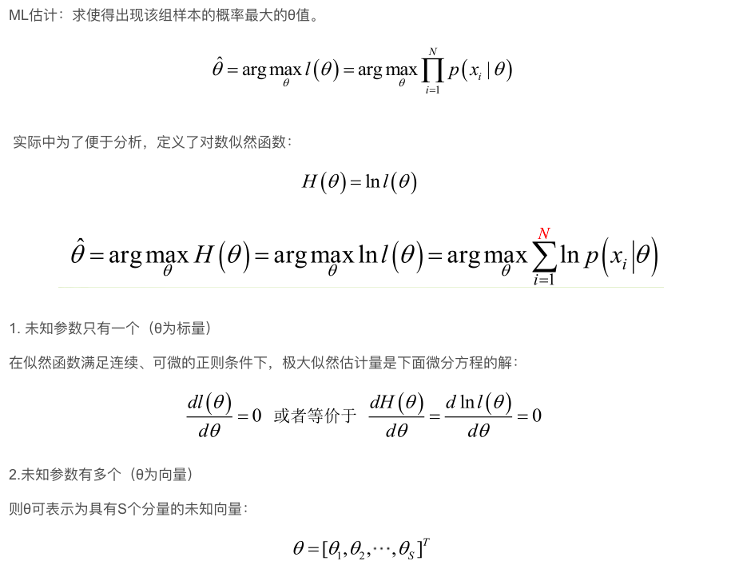

# 极大似然估计
以前多次接触过极大似然估计，但一直都不太明白到底什么原理，最近在看贝叶斯分类，对极大似然估计有了新的认识，总结如下：

## 一、贝叶斯决策
首先来看贝叶斯分类，我们都知道经典的贝叶斯公式：   
   

我们来看一个直观的例子：已知：在夏季，某公园男性穿凉鞋的概率为1/2，女性穿凉鞋的概率为2/3，并且该公园中男女比例通常为2:1，问题：若你在公园中随机遇到一个穿凉鞋的人，请问他的性别为男性或女性的概率分别为多少？

从问题看，就是上面讲的，某事发生了，它属于某一类别的概率是多少？即后验概率。

   
## 二、问题引出
   
## 三、重要前提
上面说到，参数估计问题只是实际问题求解过程中的一种简化方法（由于直接估计类条件概率密度函数很困难）。所以能够使用极大似然估计方法的样本必须需要满足一些前提假设。

**重要前提：训练样本的分布能代表样本的真实分布。每个样本集中的样本都是所谓独立同分布的随机变量 (iid条件)，且有充分的训练样本。**
## 四、极大似然估计
极大似然估计的原理，用一张图片来说明，如下图所示：   
   

总结起来，最大似然估计的目的就是：**利用已知的样本结果，反推最有可能（最大概率）导致这样结果的参数值。**

原理：极大似然估计是建立在极大似然原理的基础上的一个统计方法，是概率论在统计学中的应用。极大似然估计提供了一种给定观察数据来评估模型参数的方法，即：“**模型已定，参数未知**”。通过若干次试验，观察其结果，利用试验结果得到某个参数值能够使样本出现的概率为最大，则称为极大似然估计。

   
## 五、求解极大似然函数
   
   
## 六、极大似然估计的例子
   
  
  
  

## Reference
[1] https://blog.csdn.net/zengxiantao1994/article/details/72787849   
