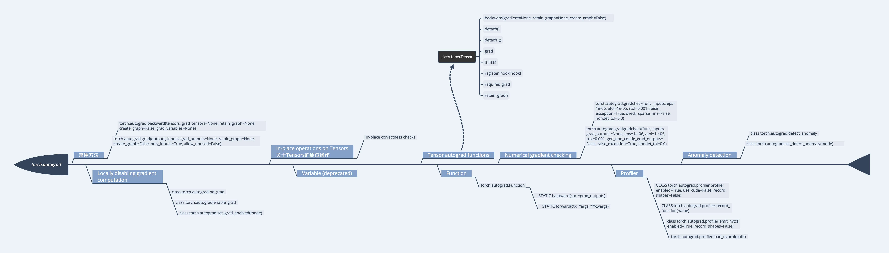

# torch.autograd
* [官方API](https://pytorch.org/docs/stable/autograd.html#)   
* [中文API](https://pytorch.apachecn.org/docs/1.2/autograd.html)   
* [d2l](http://tangshusen.me/Dive-into-DL-PyTorch/#/chapter02_prerequisite/2.3_autograd)   

 
