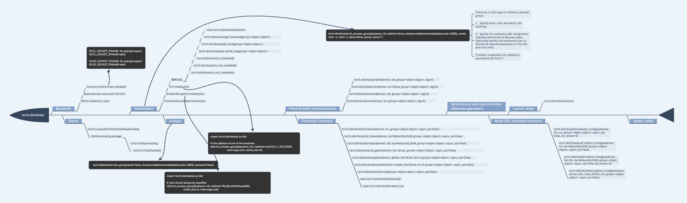

# torch.distributed
* [官方API](https://pytorch.org/docs/stable/distributed.html#)   
* [中文API](https://pytorch.apachecn.org/docs/1.2/distributed.html)   
* [d2l](http://tangshusen.me/Dive-into-DL-PyTorch/#/chapter08_computational-performance/8.4_multiple-gpus)    

