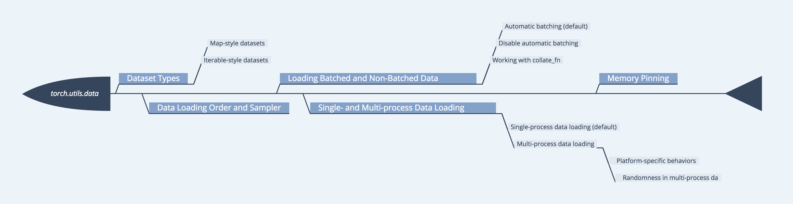

# torch.utils.data
* [官方API](https://pytorch.org/docs/stable/data.html#module-torch.utils.data)    
* [中文API](https://pytorch.apachecn.org/docs/1.2/data.html)   

 

## 实例-1（官方实例）
`../../code/load_pre.ipynb`-[🔗](../../code/load_pre.ipynb)   

解决任何机器学习问题的许多努力都用于准备数据。PyTorch提供了许多工具来简化和希望数据加载，使您的代码更具可读性。我们将了解如何从非平凡的数据集加载和预处理/扩充数据。  
要运行本教程，请确保安装了以下软件包：  
* scikit-image：对于图像io和变换
* pandas：更容易进行csv解析
## 实例-2（API翻译）
官网API[翻译](./torch_utils_data_1.md)
## 实例-3(torchvision包)
torchvision.dataset
* torchvision.datasets
    * MNIST
    * Fashion-MNIST
    * KMNIST
    * EMNIST
    * QMNIST
    * FakeData
    * COCO
    * LSUN
    * ImageFolder
    * DatasetFolder
    * ImageNet
    * CIFAR
    * STL10
    * SVHN
    * PhotoTour
    * SBU
    * Flickr
    * VOC
    * Cityscapes
    * SBD
    * USPS
    * Kinetics-400
    * HMDB51
    * UCF101
* torchvision.io
    * Video
* torchvision.models
    * Classification
    * Semantic Segmentation
    * Object Detection, Instance     Segmentation and Person Keypoint Detection
    * Video classification
* torchvision.ops
* torchvision.transforms
    * Transforms on PIL Image
    * Transforms on torch.*Tensor
    * Conversion Transforms
    * Generic Transforms
    * Functional Transforms
* torchvision.utils
## 实例-4(ImageFolder)
ImageFolder使用
ImageFolder假设所有的文件按文件夹保存好，每个文件夹下面存贮同一类别的图片，文件夹的名字为分类的名字。
```
ImageFolder(root,transform=None,target_transform=None,loader=default_loader)
```
* root : 在指定的root路径下面寻找图片 
* transform: 对PIL Image进行转换操作,transform 输入是loader读取图片返回的对象 
* target_transform :对label进行变换 
* loader: 指定加载图片的函数，默认操作是读取PIL image对象

### 例子
```
from torchvision.datasets import ImageFolder

dataset=ImageFolder('../data/dogcat/')

#对应文件夹的label
print(dataset.class_to_idx)
```
输出：
```
{'cat': 0, 'dog': 1}
```
   
```
#所有图片的路径和对应的label
print(dataset.imgs)
```
输出：
``` 
[(‘data/dogcat/cat/cat.12484.jpg’, 0), 
(‘data/dogcat/cat/cat.12485.jpg’, 0), 
(‘data/dogcat/cat/cat.12486.jpg’, 0), 
(‘data/dogcat/cat/cat.12487.jpg’, 0), 
(‘data/dogcat/dog/dog.12496.jpg’, 1), 
(‘data/dogcat/dog/dog.12497.jpg’, 1), 
(‘data/dogcat/dog/dog.12498.jpg’, 1), 
(‘data/dogcat/dog/dog.12499.jpg’, 1)]
```
   
```
#没有任何转变，所有返回的还是PIL Image对象
print(dataset[0][1]) #第二维度为1 ，表示label
print(dataset[0][0]) #第二维度为0，表示图片数据
```
输出:
``` 
0 
< PIL.Image.Image image mode=RGB size=497x500 at 0x7F25F3D31E10>
```

完整代码：
```python
# 数据处理
import os
import torch
from torch.utils import data
from PIL import Image
import numpy as np
from torchvision import transforms

transform = transforms.Compose([
    transforms.Resize(224),  # 缩放图片，保持长宽比不变，最短边的长为224像素,
    transforms.CenterCrop(224),  # 从中间切出 224*224的图片
    transforms.ToTensor(),  # 将图片转换为Tensor,归一化至[0,1]
    transforms.Normalize(mean=[.5, .5, .5], std=[.5, .5, .5])  # 标准化至[-1,1]
])


# 定义自己的数据集合
class DogCat(data.Dataset):

    def __init__(self,root,transform):
        # 所有图片的绝对路径
        imgs = os.listdir(root)

        self.imgs = [os.path.join(root, k) for k in imgs]
        self.transforms = transform

    def __getitem__(self, index):
        img_path = self.imgs[index]
        # dog-> 1 cat ->0
        label = 1 if 'dog' in img_path.split('/')[-1] else 0
        pil_img = Image.open(img_path)
        if self.transforms:
            data = self.transforms(pil_img)
        else:
            pil_img = np.asarray(pil_img)
            data = torch.from_numpy(pil_img)
        return data, label

    def __len__(self):
        return len(self.imgs)


dataSet = DogCat('../data/dataset', transform=transform)

print(dataSet[0])
```
## 实例-5(fn_collect)
fn_collect
```python
# 数据处理
import os
import torch
from torch.utils import data
from PIL import Image
import numpy as np
from torchvision import transforms

transform = transforms.Compose([
    transforms.Resize(224),  # 缩放图片，保持长宽比不变，最短边的长为224像素,
    transforms.CenterCrop(224),  # 从中间切出 224*224的图片
    transforms.ToTensor(),  # 将图片转换为Tensor,归一化至[0,1]
    transforms.Normalize(mean=[.5, .5, .5], std=[.5, .5, .5])  # 标准化至[-1,1]
])


# 定义自己的数据集合
class DogCat(data.Dataset):

    def __init__(self,root,transform):
        # 所有图片的绝对路径
        imgs = os.listdir(root)

        self.imgs = [os.path.join(root, k) for k in imgs]
        self.transforms = transform

    def __getitem__(self, index):
        img_path = self.imgs[index]
        # dog-> 1 cat ->0
        label = 1 if 'dog' in img_path.split('/')[-1] else 0
        pil_img = Image.open(img_path)
        if self.transforms:
            data = self.transforms(pil_img)
        else:
            pil_img = np.asarray(pil_img)
            data = torch.from_numpy(pil_img)
        return data, label

    def __len__(self):
        return len(self.imgs)


dataSet = DogCat('../data/dataset', transform=transform)

print(dataSet[0])
```