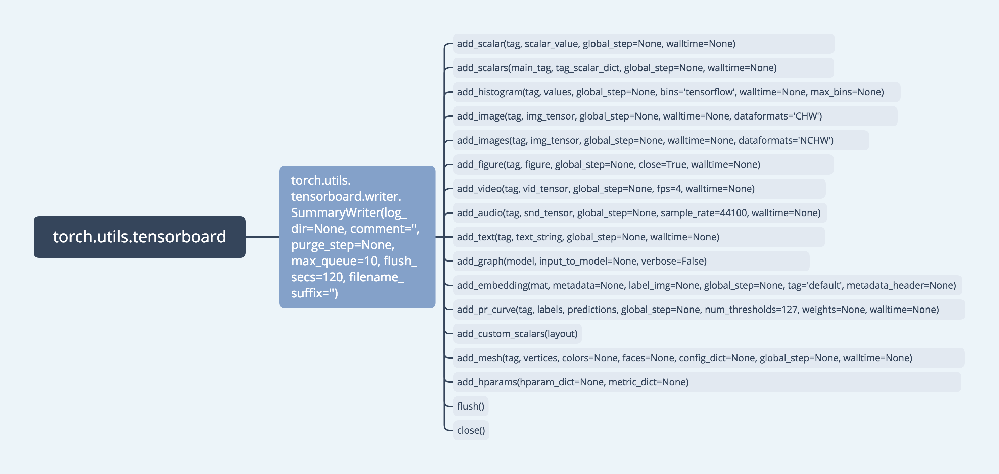

# torch.utils.tensorboard
* [官方文档](https://pytorch.org/docs/stable/tensorboard.html)    
* [中文文档](https://pytorch.apachecn.org/docs/1.2/tensorboard.html)     

* [实例-1](code/tensorboard01.py)   
* [实例-2](code/tensorboard02.py)
* [实例-3](code/tensorboard03.py)