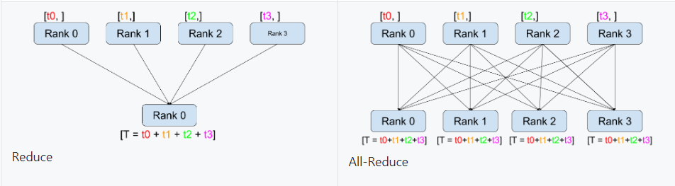
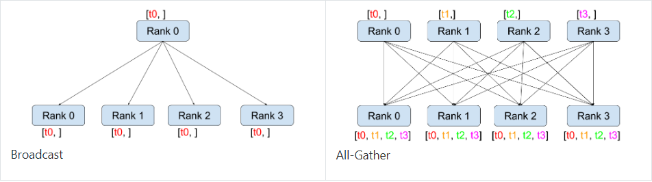

# Autograd  
torch.autograd是为方便用户使用，专门开发的—套自动求导引擎， 它能够根据输入和前向传播过程自动构建计算图，并执行反向传播。
## 一、Variable  
PyTorch在 autograd模块中实现了计算图的相关功能，autograd中的核心数据结构是Variable。Variable封装了Tensor，并记录对tensor的操作记录用来构建计算图。 Variable的数据结构如图所示，主要包含三个属性：  
* data: 保存variable所包含的tensor。  
* grad : 保存data对应的梯度， grad也是variable, 而不是 tensor, 它与data形状—致。
* grad fn : 指向一个Function, 记录tensor的操作历史，即 它是什么操作的输出，用来构建计算图。如果某一个变最是由用户创建 的，则它为叶子节点，对应的 grad_fn等于None。  
  
  
Variable的构造函数需要传入 tensor, 同时有两个可选参数。  
• requires grad (bool) 是否需要对该variable进行求导。  
• volatile (bool) 意为 "挥发”， 设置为True, 构建在该 variable之上的图都不会求导，专为推理阶段设计。  
Variable支持大部分tensor支持的函数， 但其不支持部分inplace函数， 因为这些函数会修改tensor自身，而在反向传播中， variable需要缓存原来的tensor来计算梯度。如果想要计算各个Variable的梯度，只需调用根节点 variable的backward方法， autograd会自动沿巷计算图反向传播，计算每一个叶子节点的梯度。  
`variable.backward (grad variables=None, retain graph=None, create gra ph=None)` 主要有如下参数。  
* grad_variables: 形状与variable一致，对于y.backward() , grad_variables相当千链式法则  
grad_variables也可以是tensor或序列。  
* retain_graph : 反向传播需要缓存—些中间结果，反向传播 之后，这些缓存就被清空，可通过指定这个参数不清空缓存，用来多次 反向传播。
* create_graph 对反向传播过程再次构建计算图，可通过 backward of backward实现求高阶导数。  
  
## 二、计算图  
PyTorch使用的是动态图，它的计算图在每次前向传播时都是 从头开始构建的，所以它能够使用 Python控制语句(如for、 if等)，根据需求创建计算图。这—点在自然语言处理领域中很有用， 它意味着你 不需要事先构建所有可能用到的图的路径，图在运行时才构建。  

