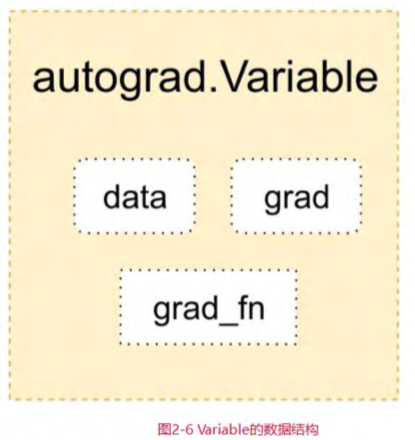

# Pytorch基础介绍    
## 1.Tensor  
Tensor是 PyTorch中里要的数据结构，可认为是一个高维数组。它可以是一个数(标量)、一维数组(向量)、 二维数组(矩阵) 或更高维的数组。 Tensor和numpy的ndarrays类似，但Tensor可以使用GPU加速。 Tensor的使用和numpy及MATLAB的接口十分相似。  
**注意**：函数名后面带下画线的函数会修改Tensor本身。例如， x.add (y) 和x.t ()会改变X, 但x.add (y) 和x.t ()会返回一个新的 Tensor, 而x不变。
  
Tensor还支持很多操作，包括数学运算、线性代数、选择、切 片等，其接口设计与 numpy极为相似 。   


Tensor和 numpy的数组间的互操作非尝容易且快速。 Tensor 不支持的操作，可以先转为 numpy数组处理，之后再转回Tensor。  
  
Tenso和 numpy对象共享内存，所以它们之间的转换很快，而且几乎不会消耗资源。这也意昧着，如果其中一个变了，另外一个也会随之改变。    
  
Tensor可通过 cuda方法转为GPU的Tensor, 从而享受GPU带来的加速运算。  
  
## 2.Autograd（自动微分）  
深度学习的算法本质上是通过反向传播求导数， PyTorch的Autograd模块实现了此功能。在Tensor上的所有操作， Autograd都能为它们自动提供微分，避免手动计算导数的要杂过程。  
  
autograd.Variable是 Autograd中的核心类，它简单封装了Tensor，并支持几乎所有的tensor操作。Tensor在被封装成Varible后，可以调用它的 .backward实现反向传播，自动计算所有梯度。Variable的数据结构如图  
  
Variable包括三个部分 ：  
data：保存Variable所包含的Tensor。  
grad：保存data对应的梯度， grad也是个Variable, 而不是 Tensor, 它和data的形状—样。  
grad_fn：指向一个Function对象，这个Function用来反向 传播计算输入的梯度。  
  
**注意**: grad在反向传播过程中是累加的（accumulated). 这意昧巷每次运行反向传播，梯度都会累加之前的梯度，所以反向传播 之前需把梯度渭零。  
## 3.torch.nn  
Autograd实现了反向传播功能，但是直接用来写深度学习的 代码在很多清况下还是稍显要杂， torch.nn是专门为神经网络设计的模块化接口。 nn构建千Autograd之上，可用来定义和运行神经网络。  
  
nn.Module是 nn中最重要的类，可以把它吾作一个网络的封装，包含网络各层定义及forward方法，调用forward (input) 方法，可返回前向传播的结果。我们以最早的卷积神经网络 LeNet为例，如何用nn.Module实现。  
```python 
import torch.nn as nn
import torch.nn.functional as F 
class Net(nn.Module):
    def __init__(self):
        # nn.module子类的函数必须在构造函数中执行父类的构造函数
        #下式等价与nn.Module.__init__(self)
        supe(Net, self).__init__()
        # 卷积层‘1’表示输入图片为单通道，‘6’表示输出通道数，‘5’表示卷积核为5*5
        self.conv1 = nn.Conv2d(1, 6, 5)
        # 卷积层
        self.conv2 = nn.Con2d(6. 16, 5)
        # 放射层/全连接层， y = Wx + b
        self.fc1 = nn.Linear(16*5*5, 120)
        self.fc2 = nn.Linear(120, 84)
        self.fc3 = nn.Linear(84, 10)
    def forword(self, x):
        # 卷积-激活-池化
        x = F.max_pool2d(F.relu(self.conv1(x)),(2, 2))
        x = F.max_pool2d(F.relu(self.conv2(x)), 2)
        # reshape, '-1'表示自适应
        x = x.view(x.size()[0], -1)
        x = F.relu(self.fc1(x))
        x = F.relu(self.fc2(x)) 
        x = self.fc3(x)  
        return x
net = Net()
print(net)

```
只要在 nn.Module的子类中定义了forward函数， backward函数就会被自动实现(利用Autograd) 。在forward 函数中可使用任何Variable支持的 函数，还可以使用 if、 for循环、 print、 log等 Python 语法，写法和 标准的 Python写法一致。  
  
网络的可学习参数通过 net.parameters ()返回， net.named_parameters可同时返回可学习的参数及名称。    
  
forward函数的输入和输出都是Variable, 只有Variable才具 有自动求导功能， Tensor是没有的，所以在输入时，需要把 Tensor封装 成Variable。  
  

## 4.损失函数  
nn 实现了神经网络中大多数的损失函数，例如 nn.MSELoss 用来计算均方误差， nn.CrossEntropyLoss用来计算交叉墒损失。  
  
## 5.优化器  
torch.optim中实现了深度学习中绝大多数的优化方法，例 如 RMSProp、 Adam、 SGD等，更便千使用，因此通第并不需要手动写上 述代码。  

