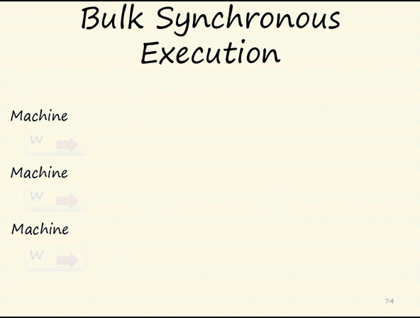
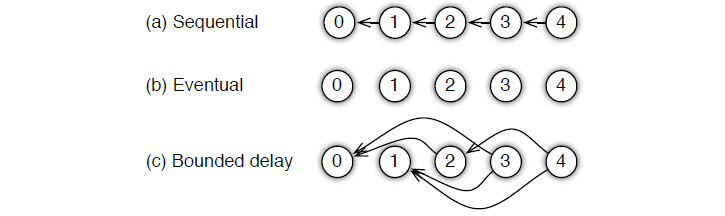
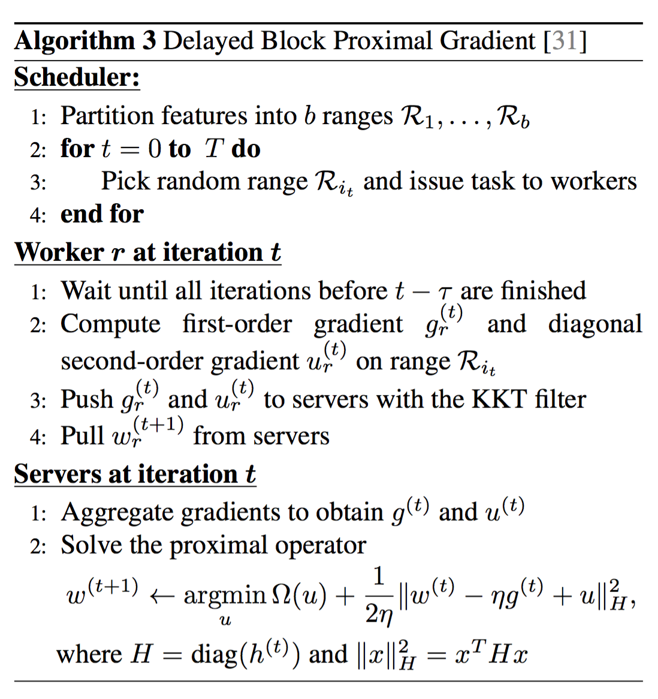

# 多卡训练
2019-04-19   
当模型和数据很大时，单个GPU无法短时间训练完模型，所以需要多GPU来训练模型。而多GPU又分为两种，即**单机多卡**和**多机多卡**。  
* 单机多卡使用torch.nn.DataParallel   
    * [参考网址1](https://pytorch.org/tutorials/beginner/blitz/data_parallel_tutorial.html)   
    * [参考网址2](https://pytorch.org/tutorials/beginner/former_torchies/parallelism_tutorial.html)
* 多机多卡使用torch.distributed
    * 
  
## 一、基础原理
在机器学习和深度学习领域，分布式的优化已经成了一种先决条件，因为单机已经解决不了目前快速增长的数据与参数带来的问题。现实中，训练数据的数量可能达到1TB到1PB之间，而训练过程中的参数可能会达到$10^9$到$10^12$。而往往这些模型的参数需要被所有的worker节点频繁的访问，这就会带来很多问题和挑战：
* 访问这些巨量的参数，需要大量的网络带宽支持；
* 很多机器学习算法都是连续型的，只有上一次迭代完成（各个worker都完成）之后，才能进行下一次迭代，这就导致了如果机器之间性能差距大（木桶理论），就会造成性能的极大损失；
* 在分布式中，容错能力是非常重要的。很多情况下，算法都是部署到云环境中的（这种环境下，机器是不可靠的，并且job也是有可能被抢占的）。
  
  
*图1 在同步的机制下，系统运行的时间是由最慢的worker节点与通信时间决定的*  
  
*图2 在异步的机制下，每个worker不能等待其它workers完成再运行下一次迭代。这样可以提高效率，但从迭代次数的角度来看，会减慢收敛的速度*   
### 1.Parameter Server架构  
在parameter server中，每个 server 实际上都只负责分到的部分参数（servers共同维持一个全局的共享参数），而每个 work 也只分到部分数据和处理任务。  
  
*图3 parameter server的架构图，server 节点可以跟其他 server 节点通信，每个server负责自己分到的参数，server group 共同维持所有参数的更新。server manager node 负责维护一些元数据的一致性，比如各个节点的状态，参数的分配情况等；worker 节点之间没有通信，只跟自己对应的server进行通信。每个worker group有一个task scheduler，负责向worker分配任务，并且监控worker的运行情况。当有新的worker加入或者退出，task scheduler 负责重新分配任务。*   
  
PS架构包括计算资源与机器学习算法两个部分。其中计算资源分为两个部分，参数服务器节点和工作节点：
* 参数服务器节点用来存储参数
* 工作节点部分用来做算法的训练
   
机器学习算法也分成两个部分，即参数和训练：
* 参数部分即模型本身，有一致性的要求，参数服务器也可以是一个集群，对于大型的算法，比如DNN，CNN，参数上亿的时候，自然需要一个集群来存储这么多的参数，因而，参数服务器也是需要调度的。
* 训练部分自然是并行的，不然无法体现分布式机器学习的优势。因为参数服务器的存在，每个计算节点在拿到新的batch数据之后，都要从参数服务器上取下最新的参数，然后计算梯度，再将梯度更新回参数服务器。   
   
这种设计有两种好处：
* 通过将机器学习系统的共同之处模块化，算法实现代码更加简洁。
* 作为一个系统级别共享平台优化方法，PS结构能够支持很多种算法。  
  
从而，PS架构有五个特点：
* 高效的通信：异步通信不会拖慢计算
* 弹性一致：将模型一致这个条件放宽松，允许在算法收敛速度和系统性能之间做平衡。
* 扩展性强：增加节点无需重启网络
* 错误容忍：机器错误恢复时间短，Vector Clock容许网络错误
* 易用性： 全局共享的参数使用向量和矩阵表示，而这些又可以用高性能多线程库进行优化。   
   
### 2.Push and Pull
在parameter server中，参数都是可以被表示成(key, value)的集合，比如一个最小化损失函数的问题，key就是feature ID，而value就是它的权值。对于稀疏参数，不存在的key，就可以认为是0。   

把参数表示成k-v， 形式更自然， 易于理，更易于编程解。workers跟servers之间通过push与pull来通信的。worker通过push将计算好的梯度发送到server，然后通过pull从server更新参数。为了提高计算性能和带宽效率，parameter server允许用户使用Range Push跟Range Pull 操作。   
  
### 3.Task:Synchronous and Asynchronous
Task也分为同步和异步，区别如下图所示：   
  
*图4 如果iter1需要在iter0 computation，push跟pull都完成后才能开始，那么就是Synchronous，反之就是Asynchronous。Asynchronous能够提高系统的效率（因为节省了很多等待的过程），但是，它可能会降低算法的收敛速率；*   
所以，系统性能跟算法收敛速率之间是存在一个平衡，你需要同时考虑：   
* 算法对于参数非一致性的敏感度
* 训练数据特征之间的关联度
* 硬盘的存储容量  
   
考虑到用户使用的时候会有不同的情况，parameter server 为用户提供了多种任务依赖方式：  
   
*图5 三种不同的依赖方式*   
* Sequential：这里其实是 synchronous task，任务之间是有顺序的，只有上一个任务完成，才能开始下一个任务。
* Eventual： 跟sequential相反，所有任务之间没有顺序，各自独立完成自己的任务。
* Bounded Delay： 这是sequential 跟 eventual 之间的一个均衡，可以设置一个τ作为最大的延时时间。也就是说，只有大于τ之前的任务都被完成了，才能开始一个新的任务；极端的情况：
    * τ=0，情况就是 Sequential；
    * τ=∞，情况就是 Eventual；   
   
### 3.PS下的算法   
算法1是没有经过优化的直接算法和它的流程图如下：   
  
*图6 算法1*  
   
*图7 算法1的流程*   
   
*图8 优化算法1后的算法3。*   
算法3中的KKT Filter可以是用户自定义过滤：
对于机器学习优化问题比如梯度下降来说，并不是每次计算的梯度对于最终优化都是有价值的，用户可以通过自定义的规则过滤一些不必要的传送，再进一步压缩带宽消耗：
* 1.发送很小的梯度值是低效的：  
    因此可以自定义设置，只在梯度值较大的时候发送；
* 2.更新接近最优情况的值是低效的：  
    因此，只在非最优的情况下发送，可通过KKT来判断；

## 二、单机多卡
* [官方参考1](https://github.com/fusimeng/pytorchexamples/blob/master/dataparallel.ipynb)  
* [参考2](https://github.com/fusimeng/pytorchexamples/blob/master/dataparallel2.ipynb)  

## 三、多机多卡（分布式）  
Pytorch 是从Facebook孵化出来的，在0.4的最新版本加入了分布式模式，比较吃惊的是它居然没有采用类似于TF和MxNet的PS-Worker架构。而是采用一个还在Facebook孵化当中的一个叫做gloo的家伙。   
[参考官方教程1](https://pytorch.org/docs/master/distributed.html)  
[参考官方教程2](https://github.com/pytorch/tutorials/blob/master/intermediate_source/dist_tuto.rst)     
这里引入了一个新的函数`model = torch.nn.parallel.DistributedDataParallel(model)`为的就是支持分布式模式.   

不同于原来在`multiprocessing`中的`model = torch.nn.DataParallel(model,device_ids=[0,1,2,3]).cuda()`函数，这个函数只是实现了在单机上的多GPU训练，**根据官方文档的说法，甚至在单机多卡的模式下，新函数表现也会优于这个旧函数**。   
   
这里要提到两个问题：
* 每个进程都有自己的Optimizer同时每个迭代中都进行完整的优化步骤，虽然这可能看起来是多余的，但由于梯度已经聚集在一起并跨进程平均，因此对于每个进程都是相同的，这意味着不需要参数广播步骤，从而减少了在节点之间传输张量tensor所花费的时间。
* 另外一个问题是Python解释器的，每个进程都包含一个独立的Python解释器，消除了来自单个Python进程中的多个执行线程，模型副本或GPU的额外解释器开销和“GIL-thrashing”。 这对于大量使用Python运行时的模型尤其重要。
   
### 1.Gloo & MPI & NCCL
* [NCCL](https://github.com/fusimeng/UnderlyingProtocol/blob/master/notes/nccl.md)  
* [Gloo](https://github.com/fusimeng/UnderlyingProtocol/blob/master/notes/gloo.md)  
[Gloo](https://github.com/facebookincubator/gloo)是一个类似MPI的通信库，你不需要考虑内存数据的拷贝，只需要实现逻辑就可以。
* [MPI](https://github.com/fusimeng/UnderlyingProtocol/blob/master/notes/mpi.md)   

### Reference:  
[1] https://www.cnblogs.com/heguanyou/p/7868596.html  
[2] https://blog.csdn.net/u010557442/article/details/79431520
