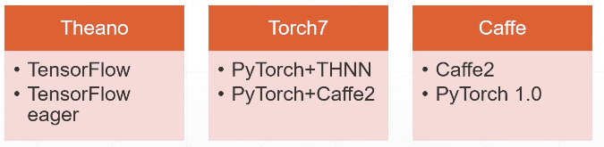
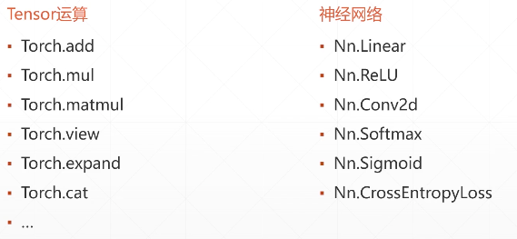
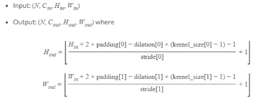
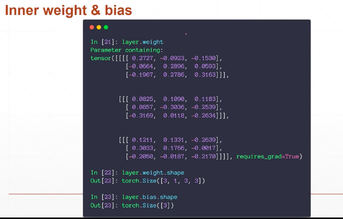

# 学习笔记 - 1  
[学习视频](https://www.bilibili.com/video/av47285205?from=search&seid=3408363769033952328)  
## 1.历史
pytorch1.0.0和caffe2融合，Facebook公司的。  
  
## 2.基础  
动态图和静态图  
tensorflow2.0=>动态优先   
## 3.优点(栗子看bilibili)  
* GPU加速 
* 自动求导  
  
* API 
  

# 学习笔记 - 2
卷积   
  
  
  
