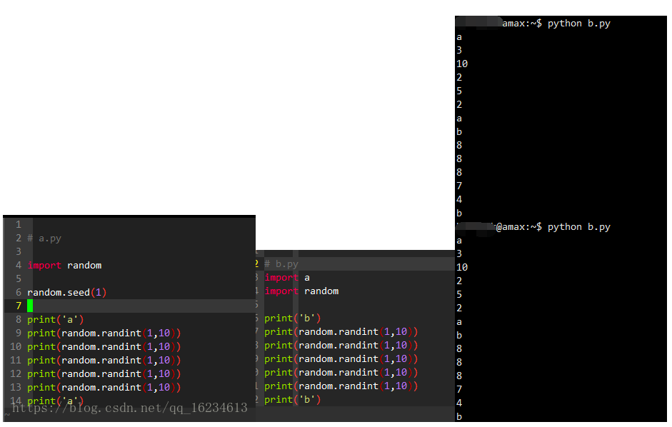
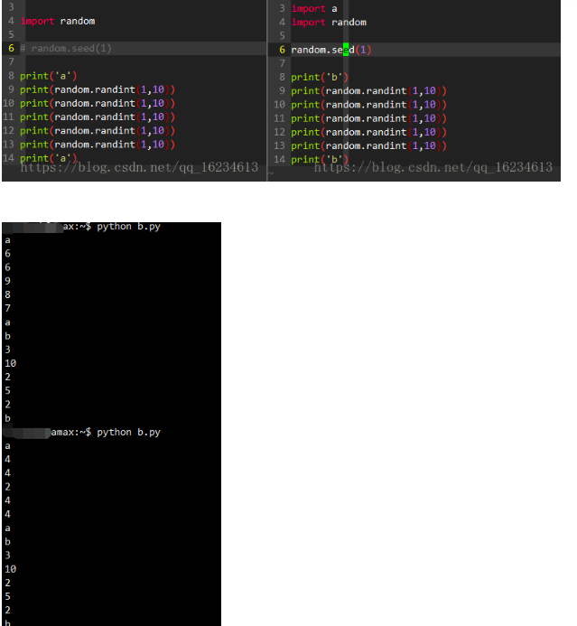
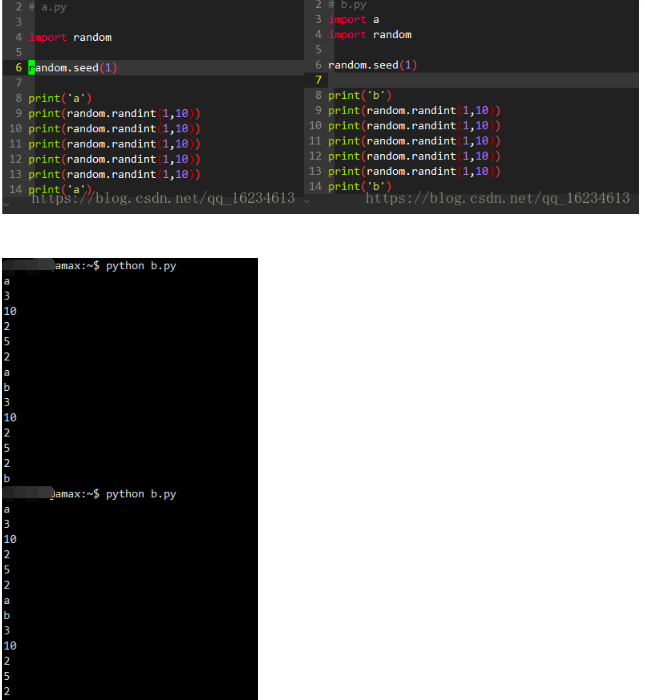
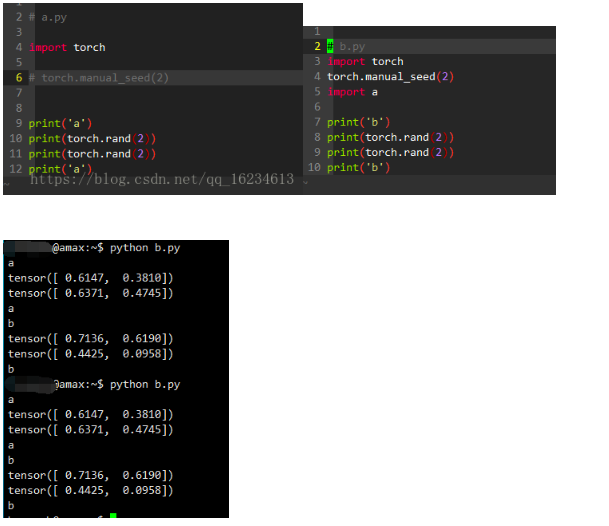

可以看到random.seed()对于import的文件同样有用。而且当你设置一个随机种子时，接下来的随机算法生成数按照当前的随机种子按照一定规律生成。也就是一个随机种子就能重现随机生成的序列。    


   
当把随机种子设置在b文件import a之后，seed种子无法对之前的随机算法产生作用。    

   
随机种子作用域在设置时到下一次设置时。要想重复实验结果，设置同样随机种子即可。    


   
在b.py import a 之前设置随机种子将会对a同样产生影响。

## 关于pytorch：
```python
torch.manual_seed(7) # cpu
torch.cuda.manual_seed(7) #gpu
np.random.seed(7) #numpy
random.seed(7) #random and transforms
torch.backends.cudnn.deterministic=True # cudnn

def worker_init_fn(worker_id):   # After creating the workers, each worker has an independent seed that is initialized to the curent random seed + the id of the worker
    np.random.seed(7 + worker_id)
train_loader = torch.utils.data.DataLoader(train_dataset, batch_size=args.batch_size, shuffle=True,num_workers=args.workers, pin_memory=True, worker_init_fn=worker_init_fn)

val_loader = torch.utils.data.DataLoader(val_dataset, batch_size=args.batch_size, shuffle=False,num_workers=args.workers, pin_memory=True, worker_init_fn=worker_init_fn)

def worker_init_fn(worker_id):                                                          
    np.random.seed(np.random.get_state()[1][0] + worker_id)
```
