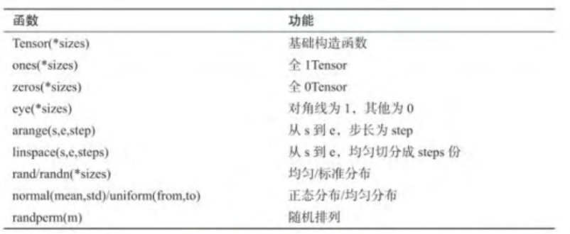
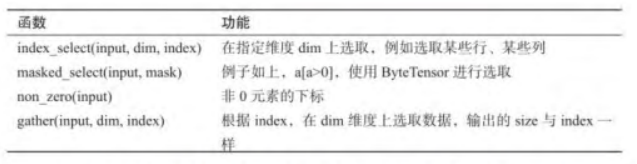
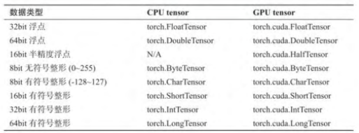
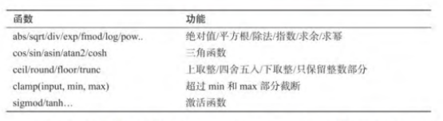
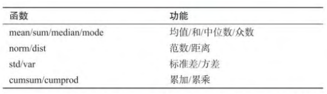
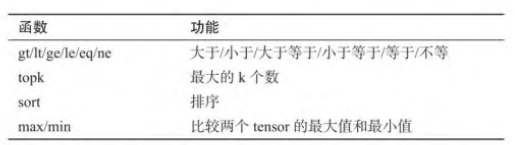
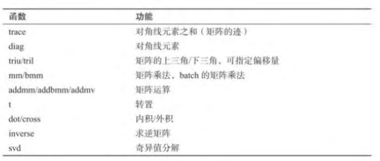

# 什么是PYTORCH？
这是一个基于Python的科学计算软件包，针对两组受众：
* NumPy的替代品，可以使用GPU的强大功能
* 深入学习研究平台，提供最大的灵活性和速度
   
## Pytorch的优点：  
* 简介：   
Pytorch中没有像TensorFlow中有session、graph、operation、name_scope、variable、tensor、layer等概念，
Pytorch的设计遵循tensor->variable(autograd)->nn.Module三个由低到高的冲向层次。
* 速度
* 活跃的社区  

## TREE
* 一、Tensor
* 二、操作
* 三、Numpy<->Tensor
* 四、CUDA Tensor
  
## 一、[Tensor](https://pytorch.org/docs/stable/torch.html)  
```
from __future__ import print_function
import torch

#构造一个未初始化的5x3矩阵
x = torch.empty(5, 3)
print(x)

#构造一个随机初始化的矩阵
x = torch.rand(5, 3)
print(x)

#构造一个矩阵填充的零和dtype long
x = torch.zeros(5, 3, dtype=torch.long)
print(x)

#直接从数据构造张量
x = torch.tensor([5.5, 3])
print(x)

#复制
x = x.new_ones(5, 3, dtype=torch.double)      # new_* methods take in sizes
print(x)

x = torch.randn_like(x, dtype=torch.float)    # override dtype!
print(x)                                      # result has the same size

#得到它的大小
print(x.size())
```
## 二、[操作](https://pytorch.org/docs/stable/torch.html)
```
#add 
y = torch.rand(5, 3)
print(x + y)

print(torch.add(x, y))

#提供输出张量作为参数
result = torch.empty(5, 3)
torch.add(x, y, out=result)
print(result)

# adds x to y
y.add_(x)
print(y)

#使用标准的NumPy索引
print(x[:, 1])

#调整大小：如果要调整张量/重塑张量
x = torch.randn(4, 4)
y = x.view(16)
z = x.view(-1, 8)  # the size -1 is inferred from other dimensions
print(x.size(), y.size(), z.size())

#如果你有一个元素张量，用于.item()获取值作为Python数字
x = torch.randn(1)
print(x)
print(x.item())
```
### 1.基础操作
从接口角度讲，对tensor的操作可分为两类：   
* （1）torch.function,如torch.save等。   
* （2）tensor.function，如tensor.view等。   

从存储的角度讲，对tensor的操作可以分为两类：   
* （1）不会修改自身的数据，如a.add(b),加法的结果返回一个新的tensor。   
* （2）会修改自身的数据，如a.add(b),加法的结果仍然存储在a中，a被修改了。   
   
#### 创建

#### 常用tensor操作
```
tensor.view()
tensor.squeeze()
tensor.unsqueeze()
tensor.resize()
```
#### 索引操作

#### tensor类型

各数据类型之间可以相互转换，type（new type）是通用的做法，同时还有float、long、
half等快捷方法。CPU Tensor和GPU Tensor之间的相互转换通过tensor.cuda和tensor.cpu的方法实现。
#### tensor逐个元素操作

#### 归并操作

#### 比较
   
#### 线性代数
   

    
## 三、Numpy<-->Tensor

将Torch Tensor转换为NumPy阵列（反之亦然）是一件轻而易举的事。  

Torch Tensor和NumPy阵列将共享其底层内存位置，更改一个将改变另一个 。  

### 1.tensor2numpy  
```
a = torch.ones(5)
print(a)


b = a.numpy()
print(b)

#了解numpy数组的值如何变化
a.add_(1)
print(a)
print(b)
```
### 2.numpy2tensor
```
import numpy as np
a = np.ones(5)
b = torch.from_numpy(a)
np.add(a, 1, out=a)
print(a)
print(b)
```

## 四、CUDA Tensor
可以使用该`.to`方法将张量移动到任何设备上。  
```
# let us run this cell only if CUDA is available
# We will use ``torch.device`` objects to move tensors in and out of GPU
if torch.cuda.is_available():
    device = torch.device("cuda")          # a CUDA device object
    y = torch.ones_like(x, device=device)  # directly create a tensor on GPU
    x = x.to(device)                       # or just use strings ``.to("cuda")``
    z = x + y
    print(z)
    print(z.to("cpu", torch.double))       # ``.to`` can also change dtype together!
```
