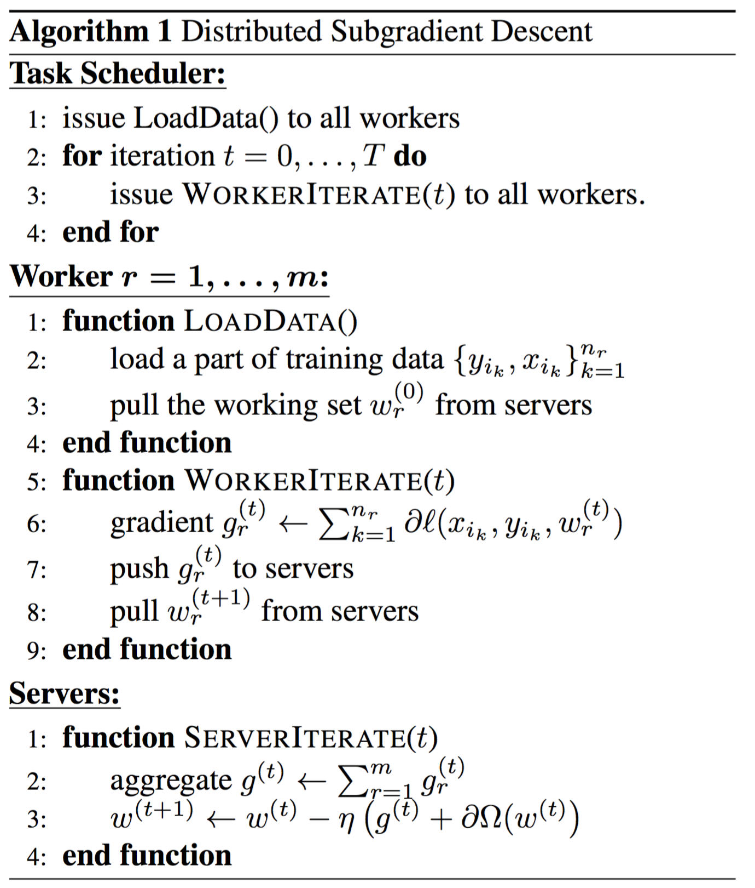
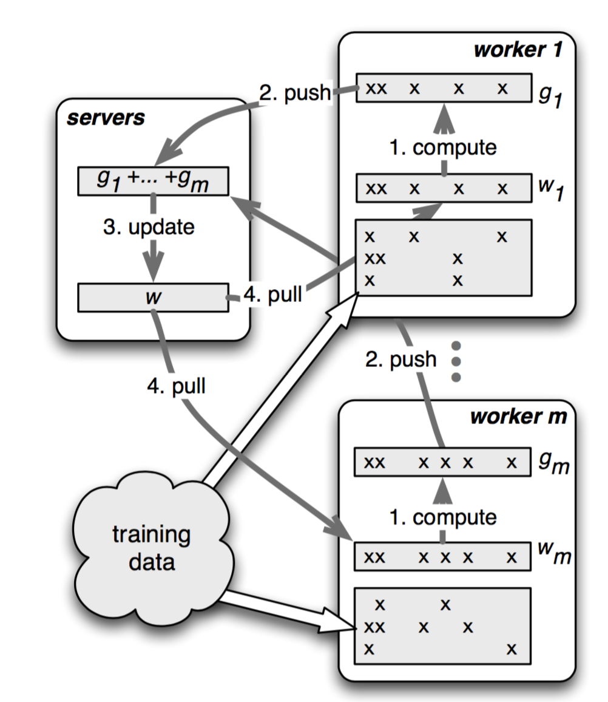
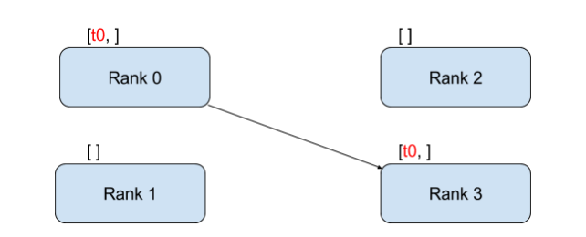
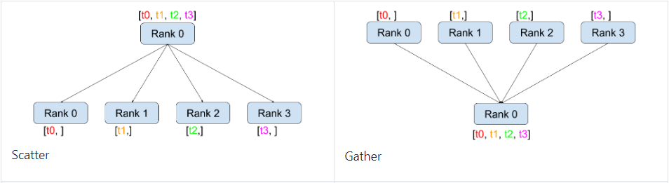

# Tensor  
Tenso和numpy的ndarrays类似，但PyTorch的 tensor支持GPU加速。  
## 一.基本操作  
从接口的角度讲，对tensor的操作可分为两类 :  
(1) torch.function, 如torch.save等。  
(2) tensor.function, 如tensor.view等。  
为方便使用，对tensor的大部分操作同时支持这两类接口，在 本书中不做具体区分。    
  
从存储的角度讲，对tensor的操作又可分为两类:  
(1) 不会修改自身的数据，如a.add (b) , 加法的结果会返
回—个新的 tensor。  
(2) 会修改自身的数据，如a.add (b) , 加法的结果仍存储
在a中 ， a被修改了。  
函数名以结尾的都是inplace方式，即会修改调用者自己的数
据，在实际应用中需加以区分。
### 1.创建Tensor
   
```python
# 指定tensor的形状
a = t.Tenaor(2, 3)
# 用 list的数据创建tensor
b = t.Tensor( [ [1,2 ,3], [4 ,5 ,6]])
# 把tensor转为list
b.tolist() 
# 获得size
b_size = b.size()
# 计算元素个数
b.numel()
# 查看shape，功能类似与size
b.shape()
```
需要注意的是， t.Tensor (*sizes) 创建tensor时，系统不会 马上分配空间只会计算剩余的内存是否足够使用，使用到tensor时才 会分配，而其他操作都是在创建完tensor后马上进行空间分配。其他常用的创建tensor方法举例（ones，......)。  
### 2.常见Tensor操作
通过tensor.view方法可以调整tensor的形状，但必须保证调整 前后元素总数—致。 view不会修改自身的数据，返回的新tensor与源 tensor共享内存，即更改其中一个，另外一个也会跟着改变。  
在实际应 用中可能经常需要添加或减少某—维度，这时squeeze和 unsqueeze两 个 函数就派上了用场。  
resize是另一种可用来调整 size的方法，但与 view不同，它可 以修改tensor的尺寸。如果新尺寸超过了原尺寸，会自动分配新的内存 空间，而如果新尺寸小千原尺寸， 则之前的数据依旧会被保存。  
### 3.索引操作/高级索引  
Tensor支持与 numpy.ndarray类似的索引操作，语法上也类似。如无特殊说明，索引出 来的结果与原tensor共享内存，即修改—个，另一个会跟着修改。  
*常用的选择函数*  
  

### 4.数据类型
*Tensor数据类型*  
  
CPU tensor 与 GPU tensor 之间的互相转换通过tensor.cuda和tensor.cpu的方法实现。   
```python
# 设置默认tensor，注意参数是字符串
t.set_default_tensor_type('torch.IntTensor')
a = t.Tensor(2, 3)
# 把a转换为FloatTensor，等价于b=a.type(t.FloatTensor)
b = a.float()
c = a.type_as(b)
d = a.new(2, 3) # 等价于torch.IntTensor(3, 4)
# 查看函数new的源码
a.new??
```
### 5.逐个元素操作
这部分操作会对tensor的每一个元素 (point-wise, 又名 element-wise) 进行操作，此类操作的输入与输出形状—致。  
  
对千很多操作，例如 div、 mul, pow、 fmod等， PyTorch都 实现了运算符玺载，所以可以直接使用运算符。例如， a\*\*2等价千 torch.pow (a, 2) , a\*2等价千torch.mul (a, 2).  
### 6. 归并操作  
此类操作会使输出形状小于输入形状 ，并可以沿着某—维度进行指定操作。如加 法sum, 既可以计算整个tensor的和，也可以计算tensor中每—行或每—列的和。  
  
### 7.比较  
比较函数中有—些是逐元素比较，操作类似千逐元素操作，还 有一些则类似于归并操作。  
  
也实现了运算符重载  
### 8.线性代数  
比较函数中有—些是逐元素比较，操作类似于逐元素操作，还 有一些则类似于归并操作。  
   
## 二、Tensor和Numpy  
Tensor和 Numpy数组之间具有很高的相似性，彼此之间的互操作也非尝简单离效。需要注意的是， Numpy和Tensor共享内存。由于Numpy历史悠久，支持丰富的操作，所以 当遇到 Tensor不支持的操作时，可先转成 Numpy数组，处理后再转回 tensor, 其转换开销很小。   
`b = t.from_numpy(a)`  
`a = t.Tensor(b)`    
### 1.广播  
虽然，Pytorch已默认支持广播，但是建议，通过以下两个函数的组合手动实现广播法则，这样更直观，更不易出错。   
*  unsqueeze或者view: 为数据某—维的形状补1，实现法则 1。  
*  expand或者expand as, 重复数组，实现法则 3; 该操作不 会复制数组，所以不会占用额外的空间。  
  
注意 repeat实现与expand相类似的功能，但是repeat会把相同数据要制多份，因此会占用额外的空间。  
## 三、内部结构  
tensor的数据结构如图所示。tensor分为头信息区(Tensor) 和存储区 (Storage) , 信息区主要保存着 tensor的形状 (size) 、步长 (stride) 、数据类型 (type) 等信息，而真正的数据则保存成连续数组。由千数据动辄成干上万，因此信息元素占用内存较少，主要内存占用取决千tensor中元素的数 目 ，即存储区的大小。  
  
## 四、持久化  
Tensor的保存和加载十分简单，使用 t.save和 t.load即可完成 相应的功能。在save/load时可指定使用的 pickle模块，在 load时还可 将GPU tensor映射到CPU或其他GPU上。  
```python
if t.cuda.is_availiable():
    a = a.cuda(1) #把a转换为GPU1上的tensor
    t.save(a, 'a.path')

# 加载为b时，存储于GPU1上（因为保存在GPU1上）  
b = a.load('a.path')
# 加载为c，存储于CPU
c = t.lood('a.pth' , map_location=lambda storoge, loc: storoge)
# 加载为d，存储于GPU0上
b = a.load('a.path'， map_location={'cuda:1':'cuda:0'})
```
## 五、向量化  
向量化计算是—种特殊的并行计算方式，一般程序在同—时间 只执行一个操作的方式，它可在同—时间执行多个操作，通常是对不同的数据执行同样的一个或一批指令，或者说把指令应用于一个数组/向量上。向量化可极大地提高科学运算的效率， Python本身是—门高级语言，使用很方便，但许多操作很低效，尤其是for循环。在科学计算程序 中应当极力避免使用 Python原生的for循环，尽量使用向量化的数值计 算。   

