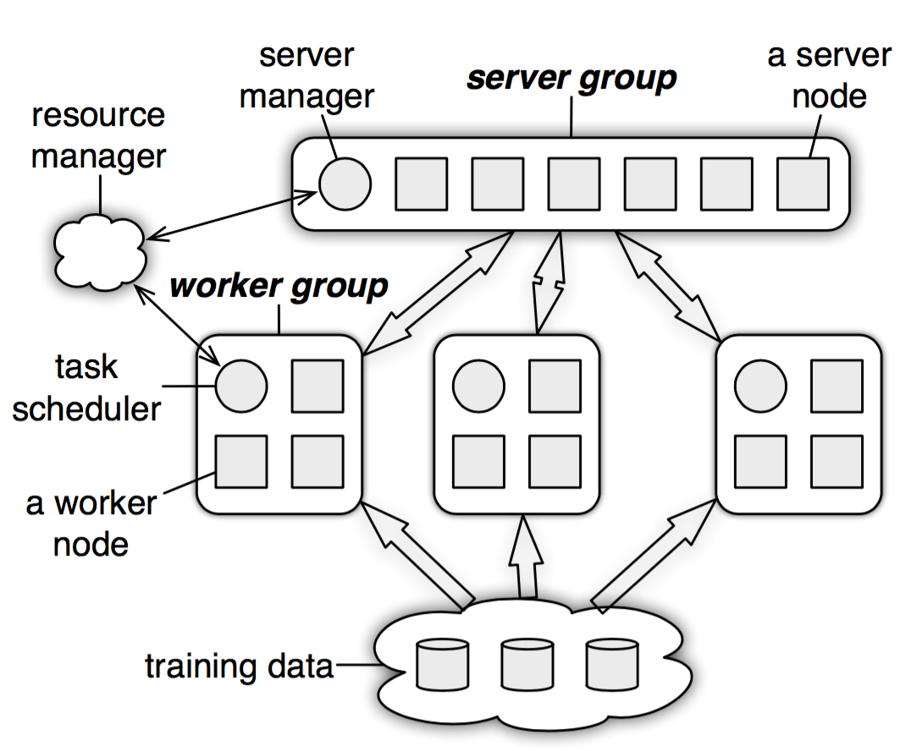
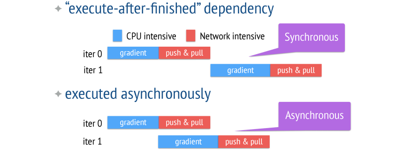

# Tensor  
Tenso和numpy的ndarrays类似，但PyTorch的 tensor支持GPU加速。  
## 一.基本操作  
从接口的角度讲，对tensor的操作可分为两类 :  
(1) torch.function, 如torch.save等。  
(2) tensor.function, 如tensor.view等。  
为方便使用，对tensor的大部分操作同时支持这两类接口，在 本书中不做具体区分。    
  
从存储的角度讲，对tensor的操作又可分为两类:  
(1) 不会修改自身的数据，如a.add (b) , 加法的结果会返
回—个新的 tensor。  
(2) 会修改自身的数据，如a.add (b) , 加法的结果仍存储
在a中 ， a被修改了。  
函数名以结尾的都是inplace方式，即会修改调用者自己的数
据，在实际应用中需加以区分。
### 1.创建Tensor
   
```python
# 指定tensor的形状
a = t.Tenaor(2, 3)
# 用 list的数据创建tensor
b = t.Tensor( [ [1,2 ,3], [4 ,5 ,6]])
# 把tensor转为list
b.tolist() 
# 获得size
b_size = b.size()
# 计算元素个数
b.numel()
# 查看shape，功能类似与size
b.shape()
```
需要注意的是， t.Tensor (*sizes) 创建tensor时，系统不会 马上分配空间只会计算剩余的内存是否足够使用，使用到tensor时才 会分配，而其他操作都是在创建完tensor后马上进行空间分配。其他常用的创建tensor方法举例（ones，......)。  
### 2.常见Tensor操作
通过tensor.view方法可以调整tensor的形状，但必须保证调整 前后元素总数—致。 view不会修改自身的数据，返回的新tensor与源 tensor共享内存，即更改其中一个，另外一个也会跟着改变。  
在实际应 用中可能经常需要添加或减少某—维度，这时squeeze和 unsqueeze两 个 函数就派上了用场。  
resize是另一种可用来调整 size的方法，但与 view不同，它可 以修改tensor的尺寸。如果新尺寸超过了原尺寸，会自动分配新的内存 空间，而如果新尺寸小千原尺寸， 则之前的数据依旧会被保存。  
### 3.索引操作/高级索引  
Tensor支持与 numpy.ndarray类似的索引操作，语法上也类似。如无特殊说明，索引出 来的结果与原tensor共享内存，即修改—个，另一个会跟着修改。  
*常用的选择函数*  
  

### 4.数据类型
*Tensor数据类型*  
  
CPU tensor 与 GPU tensor 之间的互相转换通过tensor.cuda和tensor.cpu的方法实现。   
```python
# 设置默认tensor，注意参数是字符串
t.set_default_tensor_type('torch.IntTensor')
a = t.Tensor(2, 3)
# 把a转换为FloatTensor，等价于b=a.type(t.FloatTensor)
b = a.float()
c = a.type_as(b)
d = a.new(2, 3) # 等价于torch.IntTensor(3, 4)
# 查看函数new的源码
a.new??
```
### 5.逐个元素操作
这部分操作会对tensor的每一个元素 (point-wise, 又名 element-wise) 进行操作，此类操作的输入与输出形状—致。  